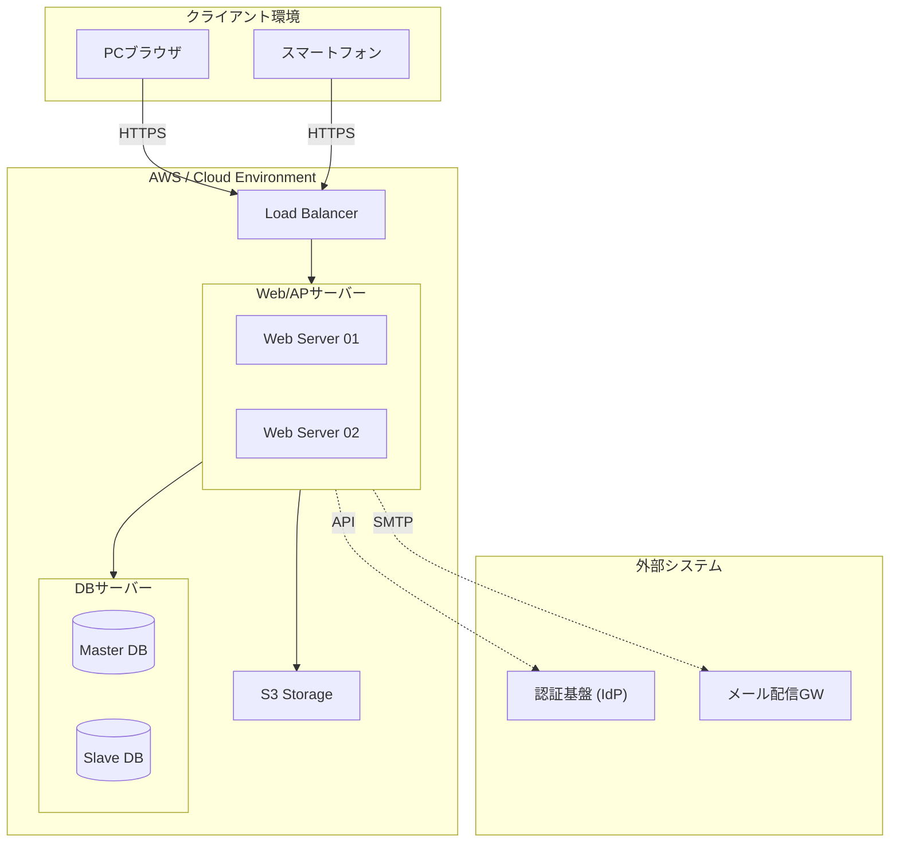

# 18. システム構成図

| 版数 | 更新日 | 更新者 | 更新内容 |
|:---|:---|:---|:---|
| 1.0 | 202X/XX/XX | 山田 太郎 | 新規作成 |

## 1. システム構成図（全体）

## 2. 構成要素一覧（スペック定義）

| カテゴリ | 役割 | サービス/製品名 | OS/Ver | 備考 |
|:---|:---|:---|:---|:---|
| Web/AP | Webサーバー | Amazon EC2 | Amazon Linux 2023 | Nginx / PHP 8.x |
| DB | データベース | Amazon RDS | MySQL 8.0 | Multi-AZ構成 |
| Storage | 画像保存 | Amazon S3 | - | |
| Client | 利用端末 | Chrome / Edge | - | 最新版推奨 |
