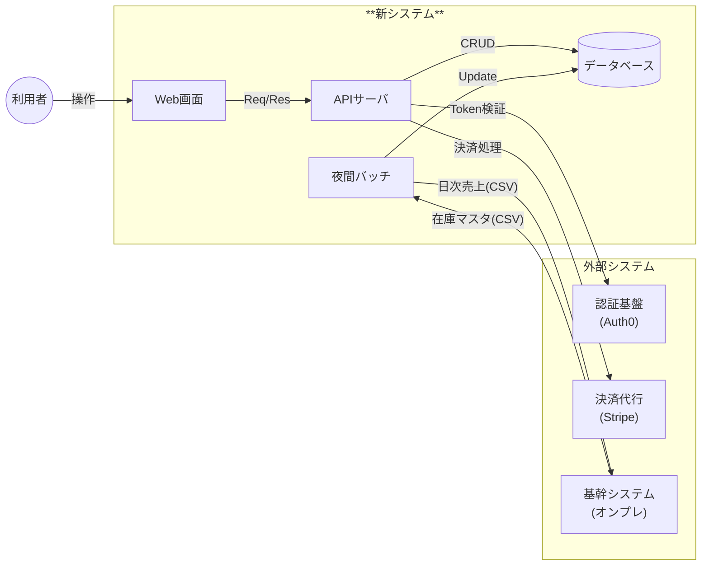

# 19. システムフロー図

| 項目 | 内容 |
| :--- | :--- |
| プロジェクト名 | {{ProjectName}} |
| 版数 | 1.0 |
| 作成日 | 202X/XX/XX |

## 1. システム間連携概要
本システムを中心とした、周辺システムとのデータの流れ（入出力）を定義する。
※詳細なI/F仕様については [28_IF一覧](./28_IF一覧.md) および [29_IF仕様書](./29_IF仕様書.md) を参照のこと。

## 2\. 連携データ一覧

| ID | データ名称 | 送信元 | 受信先 | 連携方式 | 頻度・タイミング |
| :--- | :--- | :--- | :--- | :--- | :--- |
| IF-01 | ログイン認証 | 新システム | 認証基盤 | OIDC/API | ログイン時都度 |
| IF-02 | クレジット決済 | 新システム | 決済代行 | REST API | 注文確定時 |
| IF-03 | 売上データ連携 | 新システム | 基幹システム | SFTP (CSV) | 日次 (24:00) |
| IF-04 | 在庫マスタ連携 | 基幹システム | 新システム | SFTP (CSV) | 日次 (06:00) |

## 3\. リトライ・障害対策方針

  - **API連携（同期）**: タイムアウト時は3回までリトライを行う。失敗時はユーザへエラーを表示する。
  - **バッチ連携（非同期）**: ファイル転送失敗時は管理者へアラートメールを送信し、再実行は手動判断とする。
