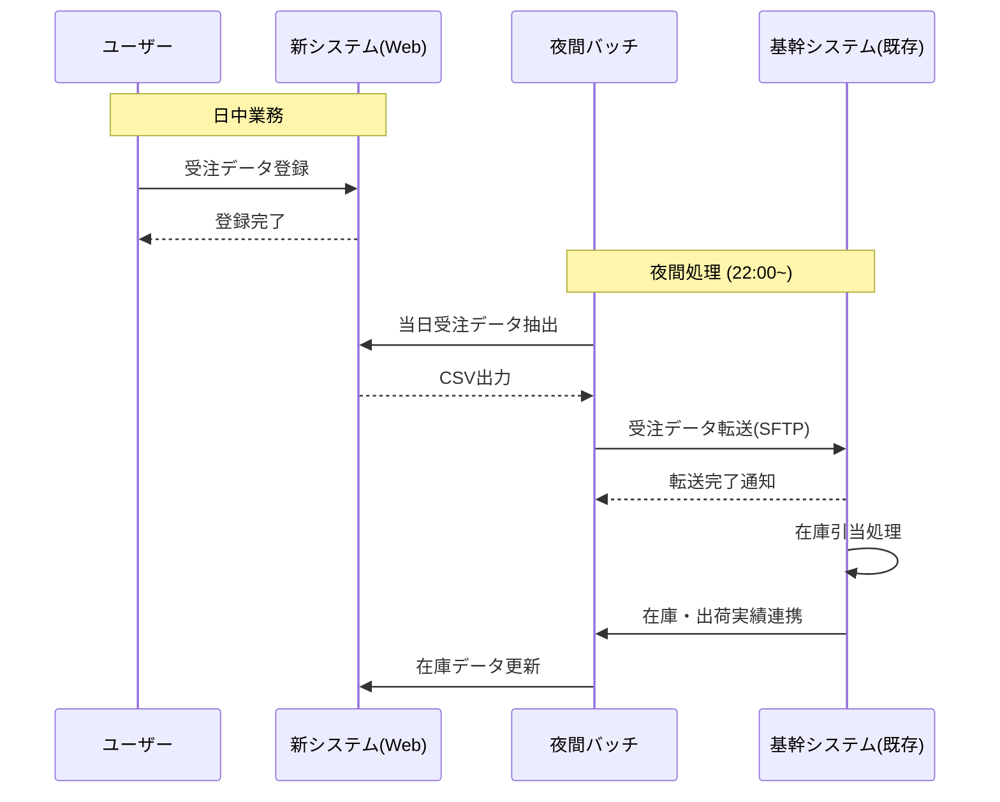

# 19. システムフロー図

| 版数 | 更新日 | 更新者 | 更新内容 |
|:---|:---|:---|:---|
| 1.0 | 202X/XX/XX | 山田 太郎 | 新規作成 |

## 1. データ連携概要
本システムにおける外部システムとの連携、および夜間バッチ処理の流れを示す。

## 2. システム連携シーケンス（日次）

## 3. 処理タイミング定義

| ID | 処理名称 | トリガー/頻度 | 方向 | データ内容 |
|:---|:---|:---|:---|:---|
| IF-001 | 受注データ連携 | 日次 (22:00) | 新 → 基幹 | 当日確定した受注情報 |
| IF-002 | 在庫データ取込 | 日次 (24:00) | 基幹 → 新 | 最新の在庫数 |
| IF-003 | 与信チェック | リアルタイム | 双方向 | 顧客の与信限度額照会 |
