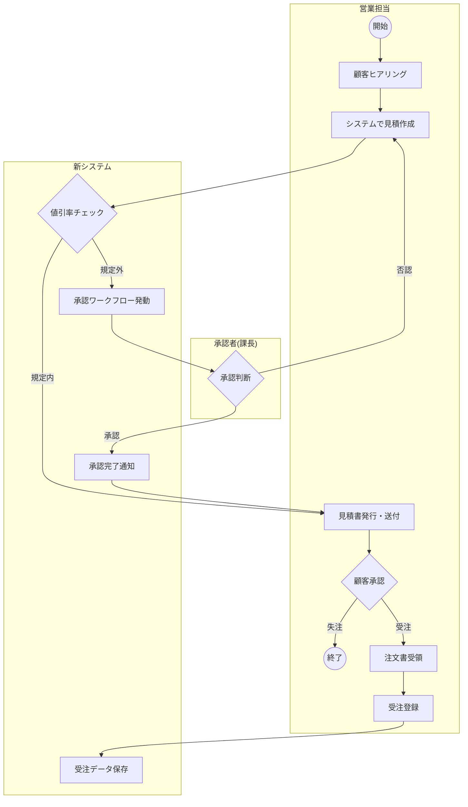

# 21. 業務フロー図

| 版数 | 更新日 | 更新者 | 更新内容 |
|:---|:---|:---|:---|
| 1.0 | 202X/XX/XX | 山田 太郎 | 新規作成 |

## 1. 凡例
* 対象業務フロー: **見積～受注プロセス**
* 区分: TO-BE (新業務フロー)

## 2. フロー図

## 3. 各ステップの詳細補足

| ステップID | 業務名 | システム機能ID | 補足事項 |
|:---|:---|:---|:---|
| B | 見積作成 | SCR-005 | 過去の見積を流用コピー可能とすること |
| H/K | 承認フロー | SCR-008 | 承認依頼はメールおよびSlackで通知すること |
