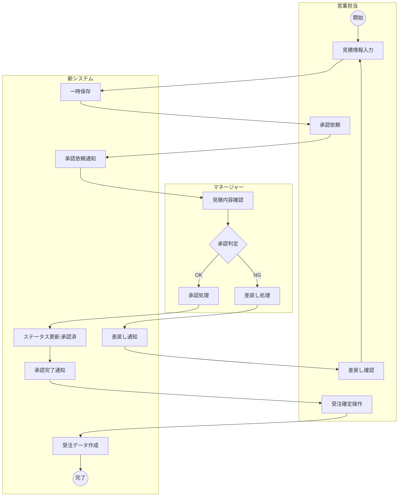
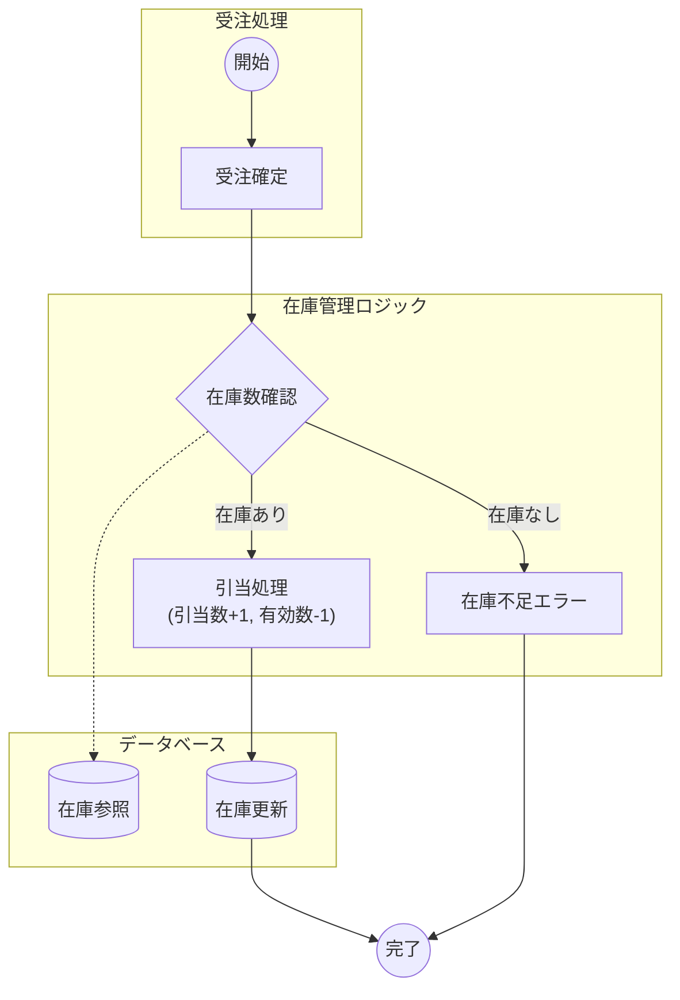

# 21. 業務フロー図

| 項目 | 内容 |
| :--- | :--- |
| プロジェクト名 | {{ProjectName}} |
| 版数 | 1.0 |
| 作成日 | 202X/XX/XX |

## 1. 概要
主要な業務プロセスについて、システムと利用者の関わり（誰が、どのタイミングで、何をするか）をスイムレーン図で定義する。

## 2. フロー詳細

### 2.1. [Flow-01] 見積〜受注プロセス
見積作成から、承認を経て受注確定するまでのフロー。

### 2.2. [Flow-02] 在庫引当プロセス

受注確定時にシステム内部で行われる自動処理フロー。

## 3\. 補足事項・例外処理

  - **承認時の金額閾値**: 見積金額が100万円未満の場合は、マネージャー承認をスキップし自動承認とする（詳細はロジック定義参照）。
  - **在庫不足時**: 画面上で「在庫不足」アラートを表示し、受注確定をブロックする。バックオーダー（取り寄せ）対応はPhase2にて検討。
