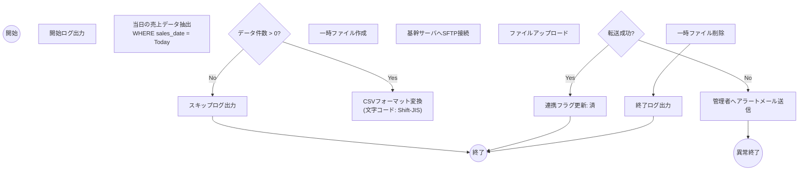
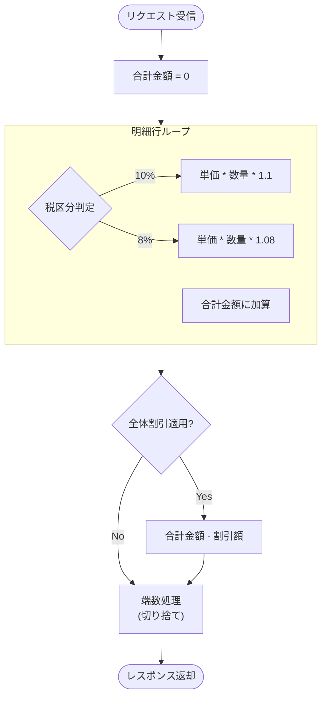

# 23. 処理フロー図（狭義の仕様書）

| 項目 | 内容 |
| :--- | :--- |
| プロジェクト名 | {{ProjectName}} |
| 版数 | 1.0 |
| 作成日 | 202X/XX/XX |

## 1. 概要
処理一覧のうち、複雑な分岐や外部連携を含む処理について、詳細なフローチャートを定義する。

## 2. 詳細フロー

### 2.1. [BAT-002] 売上データCSV出力
日次で売上データを抽出し、基幹システムへSFTP転送する処理。

### 2.2. [API-101] 見積金額計算ロジック

消費税（標準/軽減）と割引計算を含むロジック。

