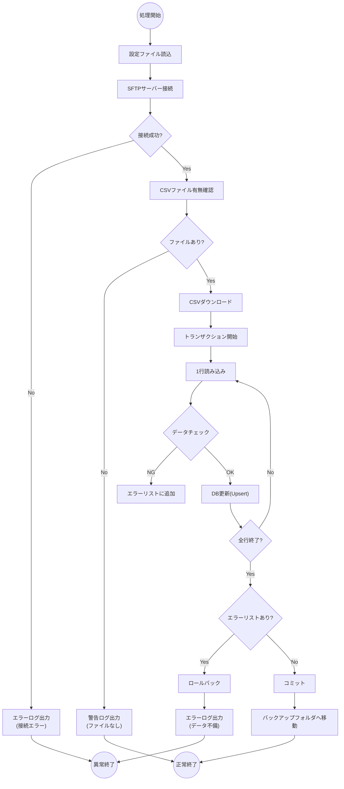

# 23. 処理フロー図（詳細仕様）

| 版数 | 更新日 | 更新者 | 更新内容 |
|:---|:---|:---|:---|
| 1.0 | 202X/XX/XX | 山田 太郎 | 新規作成 |

## 対象処理: BAT-001 夜間データ同期

## 1. 処理概要
基幹システムからSFTP連携されたCSVを読み込み、商品マスタ・在庫テーブルを更新する。

## 2. 詳細フロー

## 3. エラー処理仕様
- **接続エラー:** 3回リトライし失敗時はシステム管理者へ緊急メール。
- **データ不備:** 1件でも不正があれば全件取り込まず中止（All or Nothing）。
