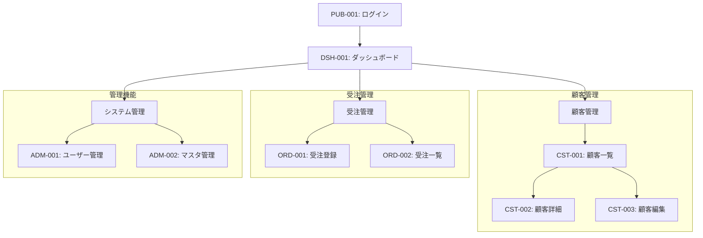

# 25. 画面全体構成図（サイトマップ）

| 版数 | 更新日 | 更新者 | 更新内容 |
|:---|:---|:---|:---|
| 1.0 | 202X/XX/XX | 山田 太郎 | 新規作成 |

## 1. 階層構造図

```mermaid
graph TD
    Login["PUB-001: ログイン"] --> Top["DSH-001: ダッシュボード"]

    Top --> Menu1["顧客管理"]
    Top --> Menu2["受注管理"]
    Top --> Menu9["システム管理"]

    subgraph Customer ["顧客管理"]
        Menu1 --> CList["CST-001: 顧客一覧"]
        CList --> CDetail["CST-002: 顧客詳細"]
        CList --> CEdit["CST-003: 顧客編集"]
    end

    subgraph Order ["受注管理"]
        Menu2 --> OEntry["ORD-001: 受注登録"]
        Menu2 --> OList["ORD-002: 受注一覧"]
    end

    subgraph Admin ["管理機能"]
        Menu9 --> UMng["ADM-001: ユーザー管理"]
        Menu9 --> MMng["ADM-002: マスタ管理"]
    end
```

## 2. メニュー表示ルール
- **一般ユーザー:** 管理メニュー非表示  
- **未ログイン:** すべてログイン画面へリダイレクト
