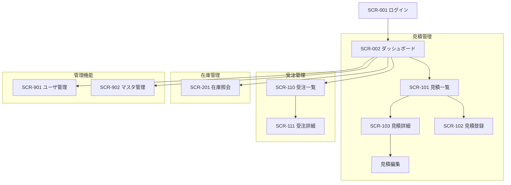

# 25. 画面全体構成図

| 項目 | 内容 |
| :--- | :--- |
| プロジェクト名 | {{ProjectName}} |
| 版数 | 1.0 |
| 作成日 | 202X/XX/XX |

## 1. 画面階層図
Webアプリケーションのルーティング階層を定義する。

## 2\. ナビゲーション設計

### 2.1. グローバルナビゲーション（ヘッダー/サイドバー）

常時表示され、以下のメニューへのショートカットを持つ。

1.  ダッシュボード
2.  見積管理
3.  受注管理
4.  在庫照会
5.  設定（管理者のみ表示）

### 2.2. パンくずリスト

階層の深い画面（詳細画面等）にはパンくずリストを表示し、上位階層へ戻れるようにする。

  - 例: TOP \> 見積管理 \> 見積詳細(No.12345)