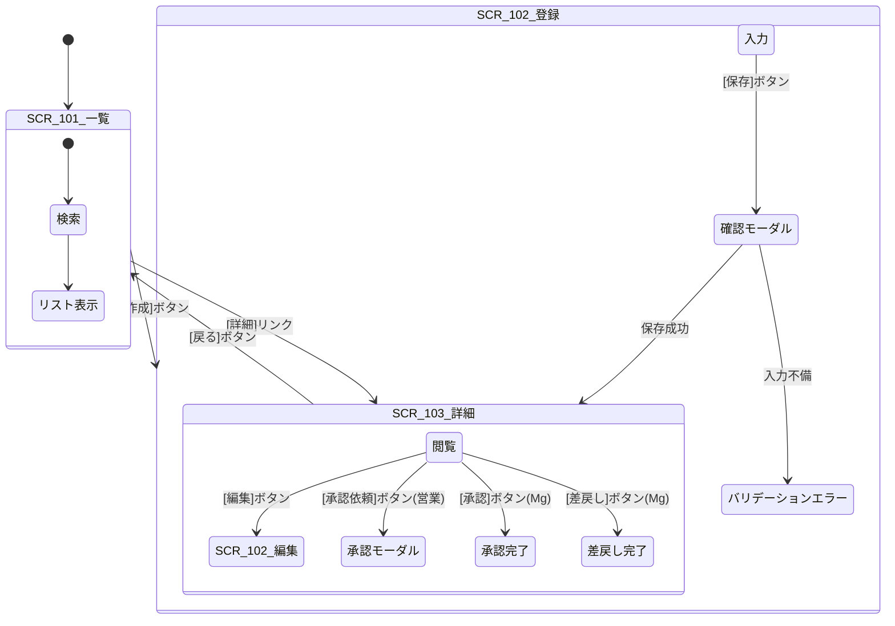

# 26. 画面フロー図

| 項目 | 内容 |
| :--- | :--- |
| プロジェクト名 | {{ProjectName}} |
| 版数 | 1.0 |
| 作成日 | 202X/XX/XX |

## 1. 概要
主要なユースケースにおける画面遷移の流れと、そのトリガーとなるアクション（ボタン押下等）を定義する。

## 2. 画面遷移詳細

### 2.1. 見積作成〜承認フロー
SCR-101(一覧) から始まり、登録・承認を行うまでの遷移。



### 2.2. 共通エラーフロー

例外発生時の遷移ルール。

```mermaid
graph LR
    Any[任意の画面] -->|セッション切れ| Login[SCR-001 ログイン]
    Any -->|権限エラー(403)| Error403[エラー画面(権限なし)]
    Any -->|システムエラー(500)| Error500[エラー画面(システム障害)]
    
    Login -->|再ログイン| Any
```

## 3\. モーダル・ポップアップ定義

画面遷移を伴わない（URLが変わらない）サブ画面の定義。

| ID | 親画面 | 名称 | 用途 |
| :--- | :--- | :--- | :--- |
| **MDL-101** | SCR-102 | 商品検索モーダル | 見積明細入力時に商品マスタを検索して選択する。 |
| **MDL-102** | SCR-103 | 承認コメント入力 | 承認または差戻し時にコメントを入力するダイアログ。 |