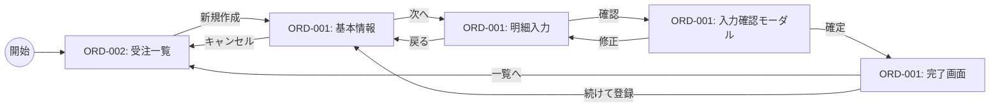

# 26. 画面遷移図

| 版数 | 更新日 | 更新者 | 更新内容 |
|:---|:---|:---|:---|
| 1.0 | 202X/XX/XX | 山田 太郎 | 新規作成 |

## ケース: 新規受注登録プロセス

## 画面遷移ルール
- **途中離脱:** キャンセル時は確認ダイアログ表示  
- **タイムアウト:** セッション切れ時はログイン画面へ遷移し、再ログイン後に元画面へ復帰  
