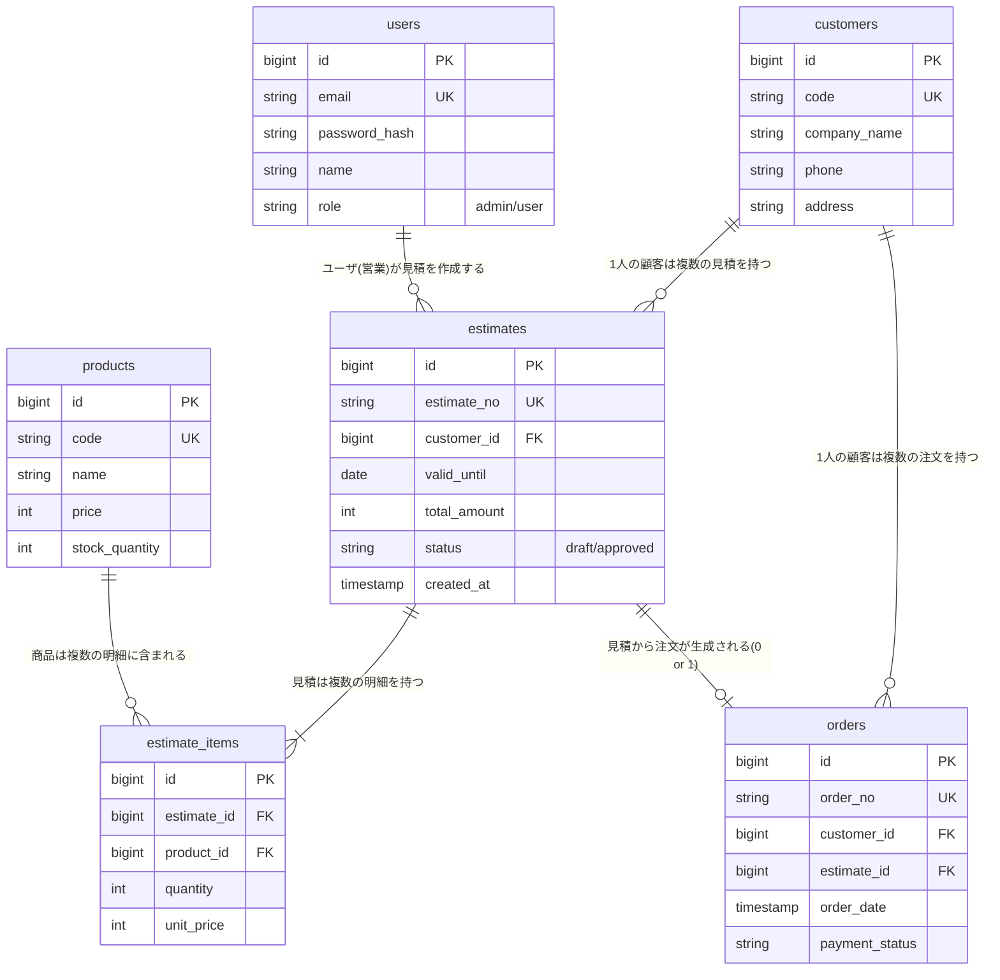

# 31. ER図

| 項目 | 内容 |
| :--- | :--- |
| プロジェクト名 | {{ProjectName}} |
| 版数 | 1.0 |
| 作成日 | 202X/XX/XX |

## 1. ER図
Mermaid記法による論理ER図。

## 2. 特記事項

  - **論理削除**: 全てのエンティティは物理削除せず、`is_deleted` フラグにて管理する。
  - **外部キー制約**: DBレベルでFK制約を付与し、不整合（Orphan Record）を防ぐ。
  - **インデックス**: `email`, `code`, `order_no` 等の検索キーおよび外部キーカラムにはIndexを作成する。
