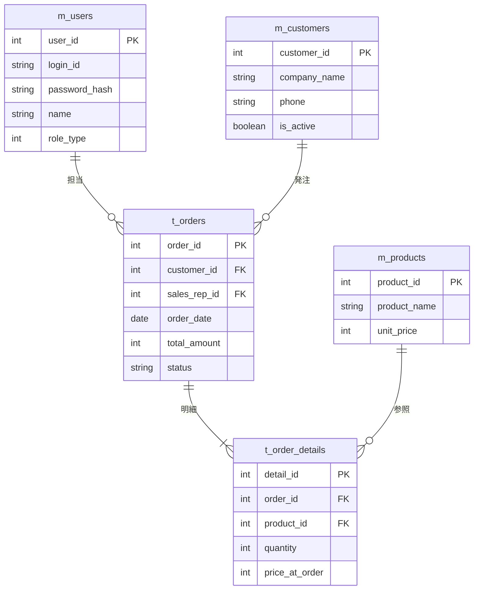

# 31. ER図 (Entity Relationship Diagram)

|版数|更新日|更新者|更新内容|
|:---|:---|:---|:---|
|1.0|202X/XX/XX|山田 太郎|新規作成|

## 1. 凡例
- `||--o{` : 1対多
- PK: 主キー / FK: 外部キー

## 2. ER図

## 3. 特記事項
- 全テーブルに `deleted_at` を持つ論理削除方式  
- `created_by`, `updated_by` により操作ユーザーを保持
