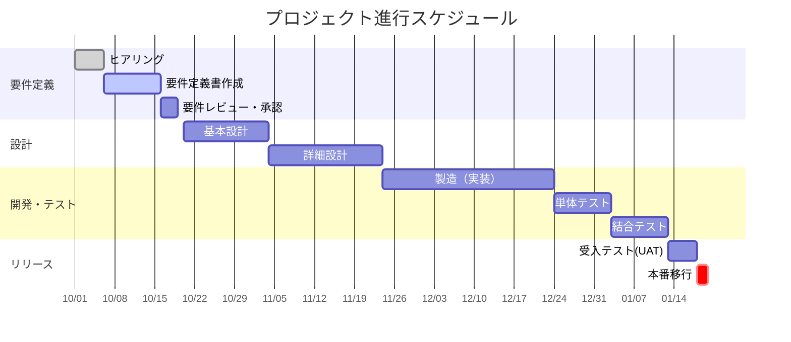

# 32. 簡易WBS / ガントチャート

| 版数 | 更新日 | 更新者 | 更新内容 |
|:---|:---|:---|:---|
| 1.0 | 202X/XX/XX | 山田 太郎 | 新規作成 |

## 1. 全体スケジュール（ガントチャート）

## 2. 主要マイルストーン

| ID | マイルストーン名 | 予定日 | 判定基準 | 備考 |
|:---|:---|:---|:---|:---|
| MS-01 | 要件定義完了 | 2023/10/19 | 要件定義書の承認受領 | |
| MS-02 | 設計完了 | 2023/11/25 | 全設計書のレビュー完了 | |
| MS-03 | 総合テスト完了 | 2024/01/30 | バグ収束曲線が基準内 | |
| MS-04 | 本番稼働 | 2024/02/10 | 切替判定会議でのGo判断 | |

## 3. タスク一覧（WBS抜粋）

| WBS ID | タスクカテゴリ | タスク名 | 担当者 | 期限 | ステータス |
|:---|:---|:---|:---|:---|:---|
| 1.1 | 基盤構築 | AWS環境セットアップ | インフラ担当 | 10/25 | 完了 |
| 1.2 | 基盤構築 | CI/CDパイプライン構築 | インフラ担当 | 10/30 | 未着手 |
| 2.1 | 画面開発 | ログイン画面実装 | フロント担当 | 11/05 | 着手中 |
