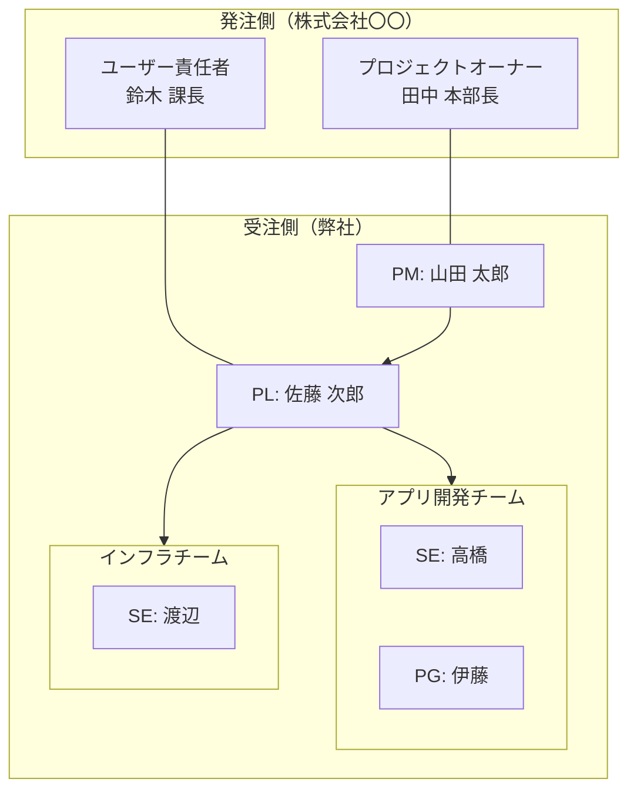

# 33. 体制図 (Organization Chart)

| 版数 | 更新日 | 更新者 | 更新内容 |
|:---|:---|:---|:---|
| 1.0 | 202X/XX/XX | 山田 太郎 | 新規作成 |

## 1. プロジェクト体制図

## 2. 役割・責任定義

| 役割 (Role) | 担当者 | 責任範囲・ミッション | 連絡先 |
|:---|:---|:---|:---|
| PM | 山田 太郎 | 全体管理 | yamada@example.com |
| PL | 佐藤 次郎 | 技術判断・指揮 | sato@example.com |
| 開発 | 高橋・伊藤 | 設計・実装 | - |
| インフラ | 渡辺 | AWS構築 | - |

## 3. 会議体
| 会議名 | 頻度 | 参加者 | 目的 |
|---|---|---|---|
| 定例会 | 週1 | PM/PL/顧客 | 進捗確認 |
| 朝会 | 毎日 | 開発全員 | タスク確認 |
