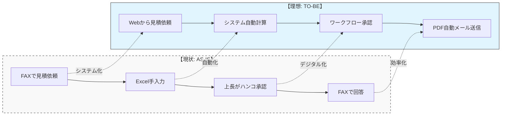

# 34. TO-BE/AS-IS図/表

| 項目 | 内容 |
| :--- | :--- |
| プロジェクト名 | {{ProjectName}} |
| 版数 | 1.0 |
| 作成日 | 202X/XX/XX |

## 1. 概要
現状の業務プロセス（AS-IS）と、本システム導入後の理想的な業務プロセス（TO-BE）を比較し、その改善効果と解決すべきギャップを明確にする。

## 2. 比較図（業務フローレベル）

## 3. ギャップ分析一覧

| 業務カテゴリ | 現状 (AS-IS) | 課題 | あるべき姿 (TO-BE) | 解決策 (System) |
| :--- | :--- | :--- | :--- | :--- |
| **見積作成** | 過去の見積書（紙ファイル）を探してコピー＆ペースト。 | 検索に時間がかかる。 転記ミスが発生する。 | 過去データを瞬時に検索・複製できる。 | **[UC-101]** 見積コピー機能の実装。 |
| **承認フロー** | 紙に出力して上長のデスクへ持参。不在時は止まる。 | 承認リードタイムが長い。 紛失リスクがある。 | 外出先からスマホで承認可能。 | **[UC-102]** クラウド承認ワークフロー。 |
| **在庫確認** | 倉庫へ電話して確認。 | 言った言わないのトラブル。 タイムラグがある。 | リアルタイムな在庫数をWebで確認。 | **[UC-201]** 在庫照会機能。 |

## 4. 業務変更への対応

システム化に伴い発生する現場作業の変更点と、それに対する教育計画。

  - **廃止作業**: FAX送受信、紙ファイリング
  - **新規作業**: マスタデータメンテナンス
  - **教育計画**: リリース1ヶ月前に操作説明会を実施する。
