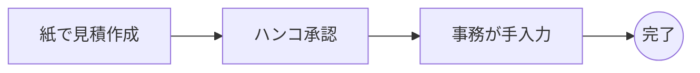
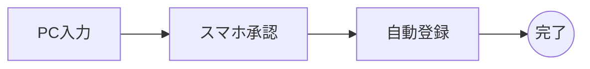

# 34. TO-BE / AS-IS 分析

| 版数 | 更新日 | 更新者 | 更新内容 |
|---|---|---|---|
| 1.0 | 202X/XX/XX | 山田 太郎 | 新規作成 |

## 業務比較

### AS-IS

### TO-BE

## Gap分析
| 項目 | AS-IS | TO-BE | 効果 |
|---|---|---|---|
| 媒体 | 紙 | WebDB | 検索性UP |
| 承認 | ハンコ | ワークフロー | 時短 |
| 入力 | 手入力 | 自動反映 | ミス削減 |
