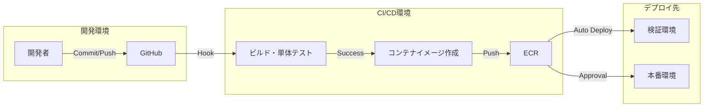

# 43. 基本設計書

| 項目 | 内容 |
| :--- | :--- |
| プロジェクト名 | {{ProjectName}} |
| 版数 | 1.0 |
| 作成日 | 202X/XX/XX |
| 作成者 | {{Author}} |
| 最新更新日 | 202X/XX/XX |
| 承認者 | {{Approver}} |

---

## 目次
1. [本書の目的・分掌](#1-本書の目的・分掌)
2. [設計方針](#2-設計方針)
3. [システム構成とアーキテクチャ概要](#3-システム構成とアーキテクチャ概要)
4. [リリースフロー設計](#4-リリースフロー設計)
5. [機能設計（方式と概要）](#5-機能設計（方式と概要）)
6. [非機能設計（方式と概要）](#6-非機能設計（方式と概要）)
7. [インフラ設計概要](#7-インフラ設計概要)
8. [開発環境設計](#8-開発環境設計)
9. [開発ルール・制約事項](#9-開発ルール・制約事項)
10. [品質・運用設計概要](#10-品質・運用設計概要)
11. [課題と対応方針](#11-課題と対応方針)
12. [変更履歴](#12-変更履歴)

---

## 1. 本書の目的・分掌
本ドキュメントは、要件定義書に基づき、システムを実現するための基本的な技術構成、アーキテクチャ、および実装方針を定義する。

### 1.1. ドキュメント間の位置付け
- **要件定義書**: 業務要件および機能要件を定義する（What）。
- **基本設計書（本書）**: システム全体の構造、共通処理、データモデルの概要、および機能ごとの**実装方式**を定義する（High-Level How）。
- **詳細設計書**: プログラム単位の処理ロジック、エラーハンドリング詳細、モジュール構成を定義する（Low-Level How）。

## 2. 設計方針
本システムを設計・構築する上での基本思想（Design Principles）を以下に定める。

1.  **疎結合と高凝集**: フロントエンドとバックエンドをAPIで分離し、将来的なUI刷新やアプリ化に柔軟に対応できる構成とする。
2.  **クラウドネイティブ**: AWS/Azureのマネージドサービスを積極採用し、運用負荷の低減と可用性の向上を図る。
3.  **セキュリティ・バイ・デザイン**: 設計段階からセキュリティ（OWASP Top 10等）を考慮し、後付けの対応を極力減らす。

## 3. システム構成とアーキテクチャ概要
### 3.1. 全体システム構成
ハードウェア、ネットワーク、外部連携の全体像。
詳細は **[18_システム構成図](../20_ITPJ_Specs/18_システム構成図.md)** を参照のこと。

### 3.2. ソフトウェアアーキテクチャ
各層の責務と採用技術を定義する。

| レイヤー | 技術スタック | 役割・責務 |
| :--- | :--- | :--- |
| **プレゼンテーション層** | React / Next.js | UI表示、入力チェック、API呼び出し |
| **アプリケーション層** | Node.js / Express | ビジネスロジック、トランザクション管理、認証・認可 |
| **データ層** | PostgreSQL | データの永続化、参照整合性の担保 |
| **インフラ層** | AWS (ECS, RDS) | コンテナ実行環境、DBホスティング |

## 4. リリースフロー設計
開発から本番公開までのコードおよび環境のライフサイクル（CI/CDパイプライン）を設計する。

  - **ブランチ戦略**: Git-flow（またはGitHub Flow）を採用。
  - **デプロイ契機**:
      - 検証環境: developブランチへのマージ時
      - 本番環境: mainブランチへのマージおよび承認タグの付与時

## 5\. 機能設計（方式と概要）

各機能カテゴリごとの「実装方式」を定義する。個別の定義書へのインデックスも兼ねる。

| 機能カテゴリ | 実装方式・方針 | 詳細参照先 |
| :--- | :--- | :--- |
| **画面UI** | SPA構成。コンポーネント指向で再利用性を高める。 デザインはMUIライブラリをベースとする。 | [24\_画面一覧]() [27\_画面ワイヤーフレーム図]() |
| **帳票** | PDF生成ライブラリをサーバサイドで使用。 非同期生成とし、完了後にダウンロードURLを通知する方式。 | - |
| **バッチ** | AWS Lambdaによるイベント駆動、またはBatchによる定期実行。 エラー時はSlackへ通知を行う。 | [22\_処理一覧]() [23\_処理フロー図]() |
| **API (I/F)** | RESTful API形式。OpenAPI(Swagger)を用いて仕様管理する。 認証はJWT(JSON Web Token)を利用。 | [28\_IF一覧]() [29\_IF仕様書]() |
| **データ** | リレーショナルモデルを採用。 論理削除フラグによる論理削除を基本とする。 | [30\_テーブル一覧]() [31\_ER図]() |

## 6\. 非機能設計（方式と概要）

要件定義書で定義された非機能要件を技術的にどう実現するかを記述する。

| 項目 | 要件レベル | 実現方式 |
| :--- | :--- | :--- |
| **可用性** | 稼働率99.5% | WebサーバおよびDBのマルチAZ構成（冗長化）。 ロードバランサ(ALB)による負荷分散。 |
| **性能** | 画面応答2秒以内 | DBインデックスの最適化。 静的コンテンツのCDN(CloudFront)配信。 Redisによるキャッシュ活用。 |
| **セキュリティ** | 通信暗号化 | ACMによるSSL証明書適用(HTTPS化)。 |
| **ログ** | 3年保存 | CloudWatch Logsへ出力し、S3へ定期アーカイブ。 |

## 7\. インフラ設計概要

  - **ネットワーク構成**: VPC設計、サブネット分割（Public/Private）、Security Group方針。
  - **サーバ構成**: インスタンスタイプ、ストレージ容量の選定根拠。
  - ※詳細は詳細設計フェーズの「インフラ詳細設計書」またはIaCコードにて定義する。

## 8\. 開発環境設計

開発メンバーが利用する標準環境を定義する。

  - **PC**: Windows 10以上 または Mac OS X
  - **IDE**: VSCode (推奨拡張機能リストを `extensions.json` で配布)
  - **仮想環境**: Docker Desktop (ローカルで本番相当のコンテナ構成を再現)
  - **言語・FWバージョン**:
      - Node.js v18.x
      - Python 3.9.x

## 9\. 開発ルール・制約事項

品質均一化のためのルールセット。

  - **コーディング規約**: ESLint / Prettier の標準設定に従う。
  - **命名規則**:
      - 変数・関数: camelCase
      - クラス: PascalCase
      - DBテーブル: snake\_case
      - ファイル名: kebab-case
  - **コミットメッセージ**: Conventional Commits（`feat:`, `fix:` 等）に準拠する。

## 10\. 品質・運用設計概要

詳細はそれぞれの専門計画書に譲るが、設計段階で考慮すべき事項を記載する。

  - **品質設計**:
      - 単体テスト（UT）はJestを用い、CIで自動実行する。
      - 詳細は [45\_テスト計画書]()（作成予定）を参照。
  - **運用設計**:
      - システム監視はCloudWatch Alarmを使用し、閾値超えでメール発報する。
      - 詳細は [53\_運用・保守計画書]()（作成予定）を参照。

## 11\. 課題と対応方針

設計段階で解決しきれなかった課題や、次フェーズへの申し送り事項。

  - 例: サードパーティツールのバージョンアップに伴う影響調査が未完了。詳細設計時にPoCを実施する。

## 12\. 変更履歴

| 版数 | 変更日 | 変更概要 | 変更理由 | 承認者 |
| :--- | :--- | :--- | :--- | :--- |
| 1.0 | 202X/MM/DD | 初版制定 | 基本設計完了に伴う | {{Approver}} |