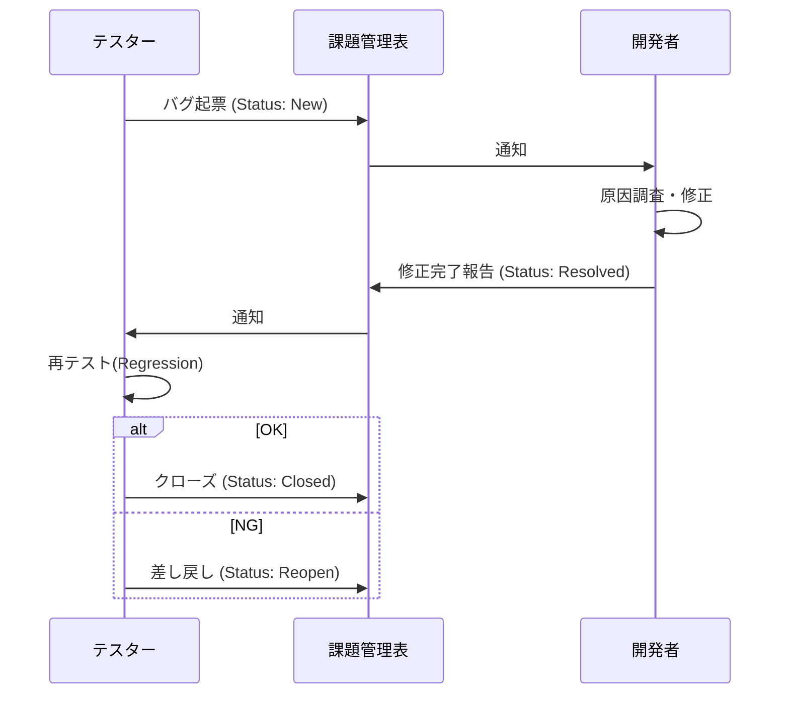
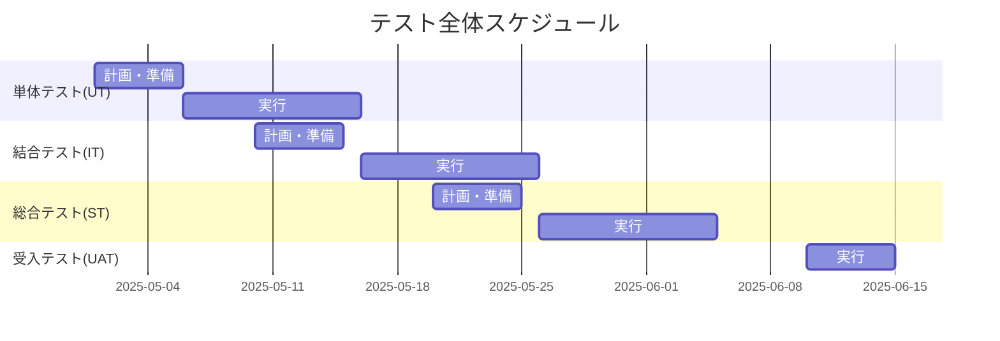

# 45. テスト計画書

| 項目 | 内容 |
| :--- | :--- |
| プロジェクト名 | {{ProjectName}} |
| 版数 | 1.0 |
| 作成日 | 202X/XX/XX |
| 作成者 | {{Author}} |
| 最新更新日 | 202X/XX/XX |
| 承認者 | {{Approver}} |

---

## 目次
1. [本書の目的・分掌](#1-本書の目的・分掌)
2. [品質目標・方針](#2-品質目標・方針)
3. [システム概要とテスト対象](#3-システム概要とテスト対象)
4. [テストの種類と定義](#4-テストの種類と定義)
5. [テスト実行方法と環境](#5-テスト実行方法と環境)
6. [テスト体制](#6-テスト体制)
7. [コミュニケーションフロー](#7-コミュニケーションフロー)
8. [テストスケジュール](#8-テストスケジュール)
9. [品質基準（開始・完了基準）](#9-品質基準開始完了基準)
10. [評価方法](#10-評価方法)
11. [各テスト工程詳細計画](#11-各テスト工程詳細計画)
12. [課題と対応](#12-課題と対応)
13. [変更履歴](#13-変更履歴)

---

## 1. 本書の目的・分掌
本ドキュメントは、プロジェクトにおける品質保証活動の全体方針、スケジュール、体制、および合格基準を定義する「全体テスト計画書」である。

- **分掌**:
    - **本書**: テスト工程全体のルール、基準、戦略を定義する。
    - **各工程の計画**: UT/IT/ST等の詳細な実施内容は、本書の方針に従い、必要に応じて個別計画書または本書内の章にて定義する。
    - **テスト設計書**: 具体的なテストケースや確認項目は、別途「46_テスト設計書」にて定義する。

## 2. 品質目標・方針
### 2.1. 品質目標
- **重大な障害ゼロ**: リリース後、業務停止に至る障害（Severity-High）の発生件数 0件。
- **要件網羅率 100%**: [42_要件定義書](../30_ITPJ_Plans/42_要件定義書.md) に記載された全ての要件がテストされていること。

### 2.2. テスト方針
- **早期発見・早期解決**: 上流工程（UT/IT）で可能な限りロジックバグを排除し、STでは業務シナリオ確認に集中する。
- **自動化の推進**: 回帰テスト（Regression Test）の効率化のため、UTおよび主要APIテストはCIによる自動実行を行う。

## 3. システム概要とテスト対象
### 3.1. システム概要
詳細は **[17_プロジェクト概要](../20_ITPJ_Specs/17_プロジェクト概要.md)** を参照。

### 3.2. テスト対象範囲（Scope）
| 対象 | UT | IT | ST | UAT | 備考 |
| :--- | :---: | :---: | :---: | :---: | :--- |
| **Webフロントエンド** | ○ | ○ | ○ | ○ | |
| **API/バックエンド** | ○ | ○ | ○ | - | |
| **バッチ処理** | ○ | ○ | ○ | ○ | |
| **外部連携I/F** | △ | ○ | ○ | ○ | UTはモックを使用 |
| **インフラ設定** | - | - | ○ | - | IaCコードはUT対象 |

**対象外**:
- サードパーティ製ライブラリ自体のバグ検証
- OS、ミドルウェアの標準機能検証

## 4. テストの種類と定義
V字モデルに基づく各テスト工程の定義。

| 工程 | 正式名称 | 目的・検証内容 | 実施主体 |
| :--- | :--- | :--- | :--- |
| **UT** | 単体テスト (Unit Test) | モジュール（関数・クラス）単体での動作確認。 ホワイトボックステスト中心。 | 開発者 |
| **IT** | 結合テスト (Integration Test) | 機能間、画面間、API連携の動作確認。 データの整合性とI/F仕様の整合性を検証。 | 開発者/テスター |
| **ST** | 総合テスト (System Test) | 実際の業務フローに基づいたエンドツーエンド（E2E）テスト。 非機能要件（性能・セキュリティ）もここで検証。 | テスター/QA |
| **UAT** | 受入テスト (User Acceptance Test) | 実際の運用者が本番相当のデータを用いて業務遂行可能か確認。 ユーザビリティの評価。 | ユーザ/顧客 |

## 5. テスト実行方法と環境
### 5.1. テストツール
- **管理ツール**: Github Issues / Excel (課題管理表)
- **自動テスト**: Jest (UT), Cypress (E2E), JMeter (性能)

### 5.2. テスト環境構成
| 環境名 | 用途 | データ | 接続先 |
| :--- | :--- | :--- | :--- |
| **開発環境** | UT, IT(一部) | 開発用ダミーデータ | 外部スタブ(Mock) |
| **検証環境** | IT, ST | マスキング済み本番コピー | 外部テスト環境 |
| **本番環境** | UAT(※), 本番 | 本番データ | 本番接続 |
※UATは検証環境実施を基本とするが、構成により本番環境を利用する場合あり。

## 6. テスト体制
詳細なメンバーアサインは **[33_体制図](../20_ITPJ_Specs/33_体制図.md)** を参照。

| ロール | 役割・責任 |
| :--- | :--- |
| **テスト管理者** | 計画策定、進捗管理、品質判定、リリース判定 |
| **テスト設計者** | テストケース作成、データ準備 |
| **テスト実行者** | テスト実施、エビデンス取得、バグ起票 |
| **開発者** | バグ調査、修正、単体テスト実施 |

## 7. コミュニケーションフロー
バグ発見から改修完了までのフロー。

## 8\. テストスケジュール

各工程の準備、実行、評価のスケジュール概要。
詳細日程は **[40\_WBS\_ガントチャート]()** にて管理する。

## 9\. 品質基準（開始・完了基準）

各フェーズのゲートとなる基準（Criteria）。

| フェーズ | 開始基準 (Entry Criteria) | 完了基準 (Exit Criteria) |
| :--- | :--- | :--- |
| **UT** | 詳細設計書が承認済みであること | C0(命令)カバレッジ80%以上 全てのテストがPassしていること |
| **IT** | UT完了基準を満たしていること 結合環境の構築完了 | 予定テストケースの実施率100% 残存バグの重要度が「低」のみであること |
| **ST** | IT完了基準を満たしていること | 業務シナリオが全てPassすること 非機能要件の目標値を満たすこと |
| **UAT** | ST完了基準を満たしていること | 顧客による検収印受領 |

## 10\. 評価方法

テスト結果を定量的に評価し、品質レポートを作成する。

  - **バグ検出密度**: 規模（kStepまたは機能数）あたりのバグ数を確認し、多すぎる/少なすぎる機能がないか分析する。
  - **バグ収束曲線**: STフェーズにおいて、バグ発生数と消化数をグラフ化し、収束傾向にあるか判断する。

## 11\. 各テスト工程詳細計画

※プロジェクト規模が大きい場合、以下の内容は別ファイル（`45_01_単体テスト計画書.md` 等）に切り出す。小規模であればここに記載する。

### 11.1. 単体テスト（UT）計画

  - **手法**: xUnit系ツールを用いた自動テスト + ホワイトボックステスト。
  - **重点項目**: 境界値分析、異常系エラーハンドリング、計算ロジック。

### 11.2. 結合テスト（IT）計画

  - **手法**: ブラックボックステスト。画面操作およびAPIコール。
  - **重点項目**: データ連携、画面遷移、トランザクション制御。

### 11.3. 総合テスト（ST）計画

  - **手法**: 業務シナリオ（ユースケース）に沿った通しテスト。
  - **シナリオベース**: [21\_業務フロー図]() を網羅する。

### 11.4. 非機能テスト計画

  - **性能テスト**: JMeterを用い、100ユーザ同時アクセス時のレスポンスを計測。
  - **セキュリティテスト**: 脆弱性診断ツール（OWASP ZAP等）によるスキャン。

### 11.5. 運用テスト計画

  - **内容**: バックアップ/リストア手順、障害時の切り替え手順、ログ確認手順の実地検証。
  - **手順書**: [54\_運用・保守手順書]() を使用して実施する。

## 12\. 課題と対応

テスト計画時点で懸念されるリスクと対策。

  - 例: 外部連携先のテスト環境が土日しか利用できないため、スケジュール調整が必要。

## 13\. 変更履歴

| 版数 | 変更日 | 変更概要 | 承認者 |
| :--- | :--- | :--- | :--- |
| 1.0 | 202X/MM/DD | 初版制定 | {{Approver}} |
