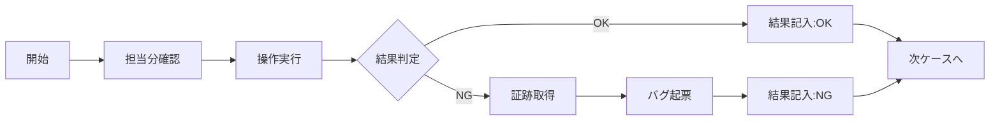

# 48. テスト手順書

| 項目 | 内容 |
| :--- | :--- |
| プロジェクト名 | {{ProjectName}} |
| 版数 | 1.0 |
| 作成日 | 202X/XX/XX |
| 作成者 | {{Author}} |
| 最新更新日 | 202X/XX/XX |

---

## 目次
1. [本書の目的・分掌](#1-本書の目的・分掌)
2. [テスト準備](#2-テスト準備)
3. [タイムテーブル（標準スケジュール）](#3-タイムテーブル標準スケジュール)
4. [テスト実行プロセス](#4-テスト実行プロセス)
5. [結果記入・報告ルール](#5-結果記入・報告ルール)
6. [バグ報告・起票フロー](#6-バグ報告・起票フロー)
7. [中断・スキップ基準](#7-中断・スキップ基準)
8. [各テスト工程固有の手順](#8-各テスト工程固有の手順)
9. [FAQ](#9-faq)
10. [付録：報告フォーマット集](#10-付録報告フォーマット集)

---

## 1. 本書の目的・分掌
本ドキュメントは、テスト実施者（テスター）がテスト業務を円滑に遂行するための具体的な手順、ルールの詳細を定義する。

- **対象読者**: テスト実施者、テスト管理者、開発担当者
- **スコープ**: テスト環境へのアクセスから、実施、結果記録、バグ起票、日次報告までの一連の業務フロー。

## 2. テスト準備
テスト開始日までに、以下の環境および権限が揃っていることを確認すること。

### 2.1. ツール・アクセス権限
| ツール名 | 用途 | 必要なアクション | 備考 |
| :--- | :--- | :--- | :--- |
| **テスト管理表** | シナリオ閲覧・結果入力 | Google Sheets / Excel へのアクセス権取得 | URL: `https://...` |
| **BTS (Jira/Github)** | バグ起票 | アカウント発行、プロジェクト参加 | |
| **検証対象システム** | テスト実行 | ブラウザでのアクセス確認、ログイン確認 | URL: `https://stg...` |
| **チャットツール** | 連絡・報告 | `##test-project` チャンネルへの参加 | Slack / Teams |
| **画面キャプチャ** | エビデンス取得 | WinShot / Skitch 等のインストール | 範囲指定ができること |

### 2.2. テストデータ準備
- テストで使用するユーザID/パスワードが配布されていること。
- 自身の担当分のデータ（注文番号など）が割り当てられていること。

## 3. タイムテーブル（標準スケジュール）
テスト期間中の標準的な1日の流れ。

| 時間 | イベント | 内容 |
| :--- | :--- | :--- |
| **09:30 - 09:45** | **朝会（テスト開始ＭＴＧ）** | ・本日の実施範囲、目標件数の確認<br>・環境状態の共有（メンテ有無など） |
| **09:45 - 12:00** | **テスト実行（午前の部）** | ・集中作業時間<br>・随時バグ起票 |
| **12:00 - 13:00** | （昼休憩） | |
| **13:00 - 16:00** | **テスト実行（午後の部）** | ・集中作業時間 |
| **16:00 - 16:30** | **バグトリアージ（夕会）** | ・本日起票されたバグの優先度判定（開発・QA・PM参加） |
| **16:30 - 17:30** | **テスト実行・予備** | ・再テスト（修正確認）<br>・残件消化、日報作成 |
| **17:30 - 17:45** | **終了報告** | ・進捗率、NG件数の報告<br>・翌日の予定確認 |

## 4. テスト実行プロセス
基本的な実行フローは以下の通り。



## 5\. 結果記入・報告ルール

### 5.1. テスト結果記入例

テスト仕様書（Excel/Spreadsheet）への記入ルール。

| カラム | 記入内容 | ルール |
| :--- | :--- | :--- |
| **実施日** | `4/1` | 実施した日付 |
| **実施者** | `佐藤` | 名字のみで可 |
| **結果** | `OK` / `NG` / `保留` | プルダウンから選択 |
| **備考・エビデンス** | (任意) | NGの場合は**バグ管理番号**を必ず記載する（例: `#Ticket-101`） |

### 5.2. エビデンス保存ルール

  - **OKの場合**: 原則不要（重要な計数確認などは除く）。
  - **NGの場合**: **必須**。エラー画面のスクリーンショット、または異常なデータ状態のキャプチャを取得する。
  - **ファイル名規則**: `No.{テストケースID}_{日時}.png` （例: `No.IT-101_20240401.png`）
  - **保存場所**: 指定のファイルサーバフォルダ、またはBTSチケットへの添付。

## 6\. バグ報告・起票フロー

挙動が仕様書と異なる場合、以下の手順で報告を行う。

1.  **再現確認**: もう一度同じ手順を行い、再現するか確認する。
2.  **既存確認**: 既に同じバグが報告されていないかBTSを検索する。
3.  **起票**: 以下のフォーマットでチケットを作成する。

### バグ起票テンプレート

> **タイトル**: [画面名] XX操作時にシステムエラーが発生する
>
> **【概要】**
> XX画面にて登録ボタン押下時に500エラーとなり、登録ができない。
>
> **【再現手順】**
>
> 1.  XX画面を開く
> 2.  必須項目を入力する
> 3.  「登録」ボタンを押下する
>
> **【期待値】**
> 登録完了画面に遷移すること。
>
> **【実際の結果】**
> 「システムエラーが発生しました」というメッセージが表示され、画面遷移しない。
>
> **【環境・データ】**
> OS: Windows 10 / Browser: Chrome
> 使用ユーザID: test\_user\_01
>
> **【添付】**
> Error\_Screenshot.png

## 7\. 中断・スキップ基準

以下の場合、テスターの判断でテストを中断またはスキップし、管理者に報告すること。

  - **ブロッキングバグ**: ログインできない、画面が開かないなど、後続のテストが一切できない場合。
  - **仕様未決**: 画面の挙動が仕様書と明らかに異なり、それが正しいか判断できない場合（質問票へ記載してスキップ）。
  - **環境ダウン**: メンテナンスや障害で接続できない場合。

## 8\. 各テスト工程固有の手順

### 8.1. 結合テスト（IT）手順

  - 複数のサブシステムを跨ぐため、データ連携の待ち時間が発生する場合がある。
  - バッチ連携確認時は、指定のジョブ実行依頼チャットにて実行を依頼すること。

### 8.2. 総合テスト（ST）手順

  - 実際の業務フローに即して行うため、**「テストデータの使い回し」に注意**する（処理済みのデータは後続テストで使えない場合がある）。

### 8.3. 非機能テスト（性能・セキュリティ）手順

  - 実施時は事前に全チームへアナウンスを行うこと（負荷により開発環境が重くなるため）。
  - 手順の詳細は別途「非機能テスト詳細手順書」を参照。

## 9\. FAQ

  - **Q. 仕様書通りの挙動だが、使いにくい。バグか？**
      - **A.** 「改善要望」として起票してください。バグとは区別して扱います。
  - **Q. テストデータが枯渇した。**
      - **A.** データ作成チームへ追加依頼を行ってください。
  - **Q. 画面が真っ白になった。**
      - **A.** ブラウザのスーパーリロード（Ctrl+F5）を試し、解決しない場合はコンソールログ（F12）を取得して開発者へ連絡してください。

## 10\. 付録：報告フォーマット集

### 10.1. 速報報告（チャット用）

重大なバグ発見時や、環境ダウン時に即座に周知するためのフォーマット。

```text
【障害速報】
発生日時：MM/DD HH:mm
発生場所：○○画面
事象概要：ログイン時に500エラーが発生し、全テスターが作業不能
影響範囲：ST全般
現在の状況：インフラチームにて調査中
```

### 10.2. 日次報告（日報メール/Wiki用）

1日の終わりに管理者がとりまとめて報告するフォーマット。

```text
To: プロジェクト関係者
Sub: 【日報】総合テスト進捗報告（MM/DD）

■サマリ
本日の予定数：100件
本日の実施数： 95件（進捗率 95%）
NG発生件数 ：  3件
残作業の見通し：遅延なし

■発生した主な障害（NG）
1. #Ticket-101 〇〇画面の金額計算誤り（高）→ 開発修正中
2. #Ticket-102 △△帳票のレイアウト崩れ（中）→ 明日確認予定

■課題・共有事項
・検証環境のレスポンスが一時的に低下しました（14:00-14:30）。
・明日は大規模バッチ実行のため、10:00-11:00はオンラインテスト不可です。

■明日の予定
・在庫管理機能のテスト（担当：佐藤、鈴木）
```
