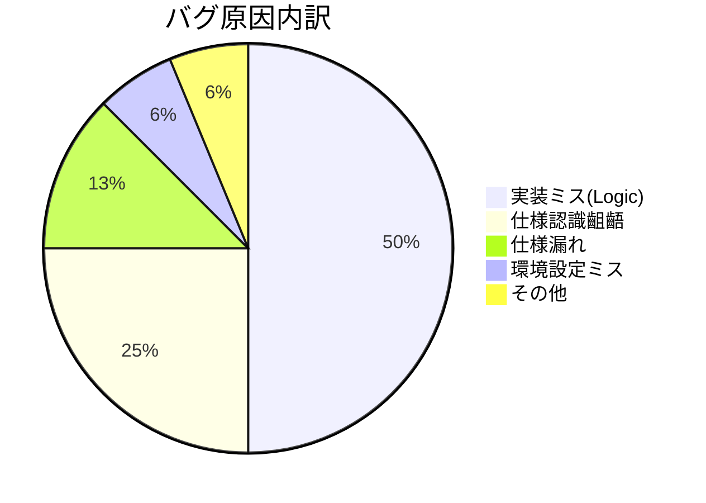

# 49. テスト結果報告書

| 項目 | 内容 |
| :--- | :--- |
| プロジェクト名 | {{ProjectName}} |
| 版数 | 1.0 |
| 作成日 | 202X/XX/XX |
| 作成者 | {{Author}} |
| 最新更新日 | 202X/XX/XX |
| 承認者 | {{Approver}} |

---

## 目次
1. [本書の目的・分掌](#1-本書の目的・分掌)
2. [システム概要とテスト対象](#2-システム概要とテスト対象)
3. [品質基準](#3-品質基準)
4. [テスト結果概要（サマリ）](#4-テスト結果概要サマリ)
5. [テスト結果定量分析](#5-テスト結果定量分析)
6. [各テスト工程の結果詳細](#6-各テスト工程の結果詳細)
7. [課題と対応（残存バグ）](#7-課題と対応残存バグ)
8. [総合判定結果](#8-総合判定結果)
9. [変更履歴](#9-変更履歴)

---

## 1. 本書の目的・分掌
本ドキュメントは、実施されたテストの結果を集計・分析し、**システムがリリース可能な品質レベルに達しているか**を評価・報告することを目的とする。

- **位置付け**: [45_テスト計画書](./45_テスト計画書.md) に対する実績報告。
- **対象読者**: プロジェクトマネージャー、品質管理責任者、顧客責任者。

## 2. システム概要とテスト対象
- **対象システム**: {{SystemName}}
- **対象バージョン**: Ver 1.0.0
- **実施期間**: 202X/MM/DD 〜 202X/MM/DD
- **実施環境**:
    - 結合テスト(IT)・総合テスト(ST): ステージング環境
    - 受入テスト(UAT): 本番環境（プレリリース）

## 3. 品質基準
テスト計画書にて定義された「完了基準」および「合格基準」。

| 項目 | 基準値 | 備考 |
| :--- | :--- | :--- |
| **テスト実施率** | 100% | 計画された全ケースが実施済みであること |
| **テスト合格率** | 100% | 全ケースがOK、または許容可能なNGであること |
| **残存バグ** | 高度障害 0件 | 運用回避不能なバグが残っていないこと |
| **バグ検出密度** | 5件/kStep ±20% | 統計的な目安範囲に収まっていること |

## 4. テスト結果概要（サマリ）
全テスト工程の集計結果。

| テスト工程 | 予定件数 | 実施件数 | 実施率 | OK件数 | NG件数 | 未実施 | 合格率 |
| :--- | :---: | :---: | :---: | :---: | :---: | :---: | :---: |
| **単体テスト(UT)** | 500 | 500 | 100% | 500 | 0 | 0 | 100% |
| **結合テスト(IT)** | 200 | 200 | 100% | 198 | 2 | 0 | 99% |
| **総合テスト(ST)** | 50 | 50 | 100% | 50 | 0 | 0 | 100% |
| **合計** | **750** | **750** | **100%** | **748** | **2** | **0** | **99.7%** |

## 5. テスト結果定量分析
品質データを分析し、潜在的なリスクがないか評価する。

### 5.1. バグ検出密度分析
- **開発規模**: 10.5 kStep
- **検出バグ総数**: 52件 (単体〜総合の合計)
- **バグ密度**: **4.95件 / kStep**

> **【評価コメント】**
> 目標値（5件/kStep）とほぼ同等であり、適正な件数が検出されていると判断する。極端に少ない機能もなく、テスト網羅性は確保されている。

### 5.2. バグ原因分析（パレート図等）
検出されたバグの原因内訳。

> **【分析】**
> 実装ミスが最多だが、設計工程起因（仕様認識齟齬＋漏れ）が30%を占めている。次期開発では設計レビューの強化が必要。

### 5.3. 信頼度成長曲線（バグ収束状況）

※Excel等で作成したPB曲線（Planned/Bug curve）の画像をここに貼り付ける。

> **【分析】**
> テスト中盤でバグ検出のピークを迎え、終盤に向けて検出数が減少し、収束（横ばい）傾向にあることを確認した。これ以上の潜在バグが残存している可能性は低いと判断する。

## 6\. 各テスト工程の結果詳細

### 6.1. 単体テスト（UT）結果

  - **実施内容**: Jestによる自動テストおよび主要ロジックの手動確認。
  - **特記事項**: 複雑な計算ロジック（税計算）にて境界値バグが多発したが、全件修正済み。
  - **エビデンス**: `docs/evidence/UT_Report.pdf` 参照。

### 6.2. 結合テスト（IT）結果

  - **実施内容**: 画面遷移、API連携の確認。
  - **特記事項**: 決済代行APIとの接続エラーが発生したが、リトライ処理の実装漏れと判明し修正済み。

### 6.3. 総合テスト（ST）結果

  - **実施内容**: 業務シナリオ（No.1〜10）の通し確認。
  - **特記事項**: 性能要件において、検索処理が3秒かかるケースがあったが、インデックス調整により1秒以内に短縮。

### 6.4. 非機能・運用テスト結果

| 項目 | 結果 | 備考 |
| :--- | :--- | :--- |
| **性能テスト** | **合格** | 100ユーザ同時アクセスにてエラーなし。 |
| **セキュリティ**| **合格** | 脆弱性診断ツールにてHighリスク検出なし。 |
| **運用テスト** | **合格** | バックアップからのリストア手順確立済み。 |

## 7\. 課題と対応（残存バグ）

リリース時点で未修正（Next Phase送り）とするバグまたは課題の一覧。

| ID | バグ・課題概要 | 重要度 | 対応方針・理由 | 予定日 |
| :--- | :--- | :---: | :--- | :--- |
| Bug-105 | 特定の旧型ブラウザでレイアウトが数ピクセルずれる | 低 | 業務遂行に影響がないため、次期改修で対応。 | 次回Rel |
| Task-99 | 運用マニュアルの画面キャプチャが旧版のまま | 低 | システム動作に影響なし。来週中に差し替え予定。 | MM/DD |

## 8\. 総合判定結果

以上の結果に基づき、本システムのリリース判定を行う。

| 判定 | **合格 (GO)** |
| :--- | :--- |
| **判定理由** | 全テスト工程を完了し、必須機能の動作および性能要件を満たすことを確認した。残存バグは軽微なものに限定されており、運用回避策も確立されているため、リリースに支障はないと判断する。 |
| **条件・付帯事項** | リリース後1週間は「初期流動管理期間」とし、開発チームによるモニタリング体制を維持すること。 |

-----

**承認:**

  - **PM**: 署名 \_\_\_\_\_\_\_\_\_\_\_\_\_\_\_\_\_\_\_\_ (202X/MM/DD)
  - **QA**: 署名 \_\_\_\_\_\_\_\_\_\_\_\_\_\_\_\_\_\_\_\_ (202X/MM/DD)
  - **顧客**: 署名 \_\_\_\_\_\_\_\_\_\_\_\_\_\_\_\_\_\_\_\_ (202X/MM/DD)

## 9\. 変更履歴

| 版数 | 変更日 | 変更概要 | 変更者 |
| :--- | :--- | :--- | :--- |
| 1.0 | 202X/MM/DD | 初版作成 | {{Author}} |
