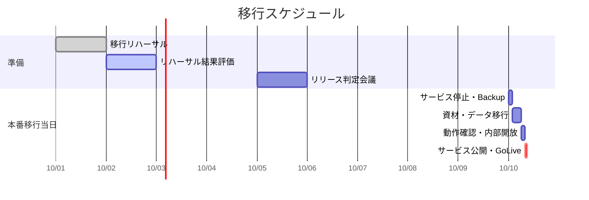

# 50. 移行計画書

| 項目 | 内容 |
| :--- | :--- |
| プロジェクト名 | {{ProjectName}} |
| 版数 | 1.0 |
| 作成日 | 202X/XX/XX |
| 作成者 | {{Author}} |
| 最新更新日 | 202X/XX/XX |
| 承認者 | {{Approver}} |

---

## 目次
1. [本書の目的・分掌](#1-本書の目的・分掌)
2. [システム概要と移行範囲](#2-システム概要と移行範囲)
3. [移行概要（方式・戦略）](#3-移行概要方式戦略)
4. [移行項目詳細](#4-移行項目詳細)
5. [移行条件（リリース判定基準）](#5-移行条件リリース判定基準)
6. [移行完了確認方法](#6-移行完了確認方法)
7. [移行体制](#7-移行体制)
8. [移行スケジュール](#8-移行スケジュール)
9. [コンティンジェンシープラン（切り戻し）](#9-コンティンジェンシープラン切り戻し)
10. [課題と対応](#10-課題と対応)
11. [変更履歴](#11-変更履歴)

---

## 1. 本書の目的・分掌
本ドキュメントは、新システムを本番環境へ展開（リリース）し、業務利用を開始するための計画、手順の概要、および緊急時の対応方針を定義する。

- **移行計画書（本書）**: 「いつ」「誰が」「どのような判断基準で」移行を行うかという**戦略**を定義する。
- **移行手順書 (No.51)**: 具体的なコマンドや操作手順（**作業レベル**）を定義する。
- **運用保守計画書 (No.53)**: 移行完了後（カットオーバー後）の定常運用ルールを定義する。

## 2. システム概要と移行範囲
### 2.1. 移行対象システム
詳細は **[17_プロジェクト概要](../20_ITPJ_Specs/17_プロジェクト概要.md)** および **[18_システム構成図](../20_ITPJ_Specs/18_システム構成図.md)** を参照。

### 2.2. 移行範囲（Scope）
| 対象 | 移行要否 | 概要 |
| :--- | :---: | :--- |
| **アプリケーション** | 対象 | Webアプリ、バッチプログラムの新規デプロイ |
| **データベース** | 対象 | 新規スキーマ作成、初期マスタデータ投入 |
| **移行データ** | 対象 | 旧システムからの顧客データ移行（CSV取込） |
| **インフラ** | 対象外 | AWS環境は構築済み（IaC適用済み）とする |
| **クライアントPC** | 対象外 | 既存ブラウザを利用するためセットアップ不要 |

## 3. 移行概要（方式・戦略）
本プロジェクトにおける移行方式の方針。

- **移行方式**: 一斉移行（ビッグバン）方式
    - 旧システムを停止し、メンテナンス時間を設けて新システムへ切り替える。
- **移行期間**: 202X年XX月XX日（金）夜間 〜 XX月XX日（日）
- **並行稼働**: なし（新旧の二重入力は行わない）

## 4. 移行項目詳細
移行作業をカテゴリ別に定義する。

### 4.1. システム移行（アプリ・インフラ）
| 項目 | 内容 | 移行方法 | 備考 |
| :--- | :--- | :--- | :--- |
| アプリ資材展開 | ビルド済みコンテナイメージの展開 | CI/CDパイプライン実行 | タグ: `release-v1.0` |
| DBスキーマ適用 | テーブル、インデックス作成 | マイグレーションスクリプト実行 | |
| バッチ設定 | ジョブスケジューラ登録 | EventBridge設定有効化 | 初回は停止状態でデプロイ |

### 4.2. データ移行
移行対象データの定義。構造は [31_ER図](../20_ITPJ_Specs/31_ER図.md) 参照。

| 項目 | データ量(想定) | 移行方法 | 備考 |
| :--- | :--- | :--- | :--- |
| ユーザマスタ | 1,000件 | 旧DBよりCSV抽出→加工→新DBへImport | パスワードは初期化 |
| 商品マスタ | 500件 | 同上 | |
| 過去トランザクション | 10万件 | **移行対象外** | 旧システムを閲覧用として残す |

### 4.3. ノウハウ移行（教育・引き継ぎ）
開発チームから運用・業務チームへのトランスファー。
※詳細な運用ルールは [53_運用・保守計画書](../70_Operation/53_運用・保守計画書.md) にて定義済み。ここでは「移行期間前後のタスク」のみ定義する。

| 項目 | 内容 | 対象者 | 時期 |
| :--- | :--- | :--- | :--- |
| 操作説明会 | 実際の画面を使った操作レクチャー | 業務ユーザ | リリース2週間前 |
| 運用引き継ぎ会 | ログ確認方法、再起動手順のハンズオン | インフラ運用担当 | リリース1週間前 |

### 4.4. その他（設備・周知等）
| 項目 | 内容 | 担当 | 備考 |
| :--- | :--- | :--- | :--- |
| DNS切り替え | ドメインの向き先を新環境へ変更 | インフラ担当 | TTL設定に注意 |
| 顧客周知 | メンテナンス画面の掲出、メール配信 | 営業担当 | |
| コールセンター | 問合せ対応マニュアルの配備完了確認 | CS担当 | |

## 5. 移行条件（リリース判定基準）
移行作業（本番作業）に着手するためのGo/No-Go判定基準。

### 5.1. システム観点
- [ ] 総合テスト(ST)および受入テスト(UAT)が完了し、完了基準を満たしていること。
- [ ] 残存バグに「高（Severity-High）」が含まれていないこと。
- [ ] 移行リハーサルを実施し、手順書に不備がないことが確認されていること。

### 5.2. 業務・体制観点
- [ ] 利用者向けマニュアルの配布が完了していること。
- [ ] 移行当日の連絡体制・承認者が確保されていること。
- [ ] 顧客窓口（コールセンター等）の対応準備が完了していること。

## 6. 移行完了確認方法
移行作業終了後、サービス開始（オープン）を判断するための確認項目。

| 確認項目 | 方法 | 担当 |
| :--- | :--- | :--- |
| **サービス正常性** | ブラウザからトップページが表示され、ログインできること | 開発・QA |
| **データ整合性** | 移行レコード件数が、旧システム抽出件数と一致すること | 開発 |
| **外部連携** | 決済システム等の外部接続テストが成功すること | 開発 |
| **監視設定** | 監視ツールが「正常」ステータスであること | 運用 |

## 7. 移行体制
移行当日のシフトおよび役割。詳細は **[33_体制図](../20_ITPJ_Specs/33_体制図.md)** をベースとする。

| ロール | 担当者 | 当日の役割 |
| :--- | :--- | :--- |
| **移行総責任者** | PM | 移行開始・中止・公開の最終判断を行う。 |
| **作業責任者** | PL | 各作業の進捗管理、障害時の一次切り分け。 |
| **アプリ作業者** | 開発メンバー | デプロイ、データ移行、動作確認。 |
| **インフラ作業者** | 基盤メンバー | バックアップ、DNS切替、監視設定。 |
| **業務確認者** | 顧客担当 | 本番環境での最終確認（Sanity Check）。 |

## 8. 移行スケジュール
移行リハーサルから本番移行当日までのマイルストーン。

詳細な時系列手順（タイムテーブル）は、[51\_移行手順書]() にて定義する。

## 9\. コンティンジェンシープラン（切り戻し）

移行作業中にトラブルが発生した場合の対応方針。

### 9.1. 移行中止・切り戻し判断基準

以下のいずれかに該当する場合、作業を中断し「切り戻し（Rollback）」を行う。

1.  予定終了時刻を **2時間** 超過しても完了の見込みが立たない場合。
2.  データの不整合が発生し、リカバリ不能と判断された場合。
3.  致命的なバグが発見され、当日中の修正が不可能な場合。

### 9.2. タイムリミット（判断ポイント）

| 時刻 | ポイント | 判断内容 |
| :--- | :--- | :--- |
| **XX:00** | DB移行完了時 | データ移行に失敗したら即時切り戻し。 |
| **YY:00** | 動作確認終了時 | 致命的バグがあれば切り戻し。 |
| **ZZ:00** | **リミット** | これ以降は切り戻し不可。Fix Forward（修正して進む）のみ。 |

### 9.3. 切り戻し手順概要

1.  新環境の停止。
2.  DNS設定を旧環境へ戻す。
3.  メンテナンス画面の解除（旧環境でのサービス再開案内）。
4.  原因調査および再移行計画の策定（翌日以降）。

## 10\. 課題と対応

  - 移行リハーサルにてデータ移行に想定以上の時間がかかったため、本番ではスペックを上げて実施する予定。
  - 旧システムの停止タイミングについて、広報部との調整が未完了。

## 11\. 変更履歴

| 版数 | 変更日 | 変更概要 | 承認者 |
| :--- | :--- | :--- | :--- |
| 1.0 | 202X/MM/DD | 初版制定 | {{Approver}} |