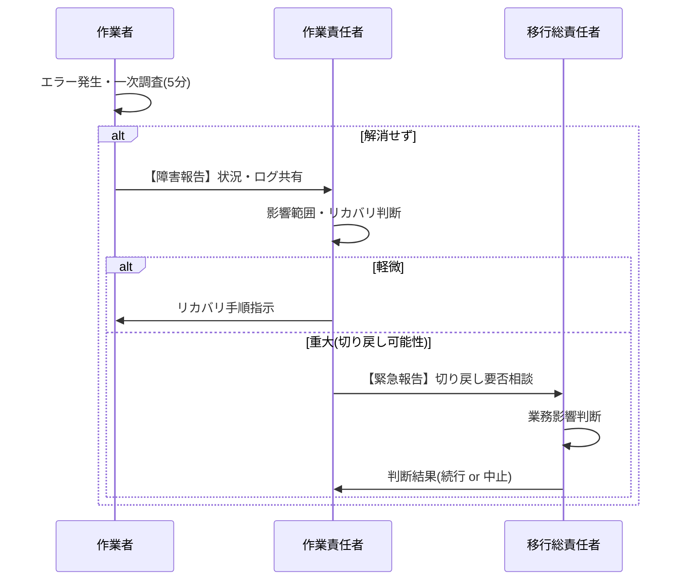

# 51. 移行手順書

| 項目 | 内容 |
| :--- | :--- |
| プロジェクト名 | {{ProjectName}} |
| 版数 | 1.0 |
| 作成日 | 202X/XX/XX |
| 作成者 | {{Author}} |
| 最新更新日 | 202X/XX/XX |
| 承認者 | {{Approver}} |

---

## 目次
1. [本書の目的・分掌](#1-本書の目的・分掌)
2. [概要と前提条件](#2-概要と前提条件)
3. [詳細タイムテーブル（進行表）](#3-詳細タイムテーブル進行表)
4. [移行前チェックリスト](#4-移行前チェックリスト)
5. [各手順詳細](#5-各手順詳細)
6. [移行停止条件と連携フロー](#6-移行停止条件と連携フロー)
7. [移行後チェックリスト](#7-移行後チェックリスト)
8. [変更履歴](#8-変更履歴)

---

## 1. 本書の目的・分掌
本ドキュメントは、**[50_移行計画書](./50_移行計画書.md)** で策定された方針に基づき、本番移行作業を確実かつ安全に遂行するための**詳細手順（コマンド、操作レベル）**を定義する。

- **役割**: 当日の作業者は本書の「詳細タイムテーブル」および「手順詳細」に従って作業を進める。
- **原則**: 本書に記載のないコマンドや操作は、トラブル対応時を除き原則禁止とする。

## 2. 概要と前提条件
### 2.1. 作業概要
- **作業日時**: 202X年XX月XX日（金） 20:00 〜 24:00
- **対象環境**: 本番環境（Production）
- **接続方法**: 専用VPN経由でBastion（踏み台）サーバへSSH接続

### 2.2. 前提条件
- 作業端末に以下のツールがインストールされていること。
    - AWS CLI v2.x
    - PostgreSQL Client v13
    - SSH Client (OpenSSH)
- 作業用アカウントのMFA（多要素認証）設定が完了していること。
- 連絡用チャットツール（Slack等）が利用可能であること。

## 3. 詳細タイムテーブル（進行表）
当日の進行スケジュールおよびタスク一覧。
**※作業完了ごとに「チェック」を入れること。**

| ID | 時間(目安) | タスク名 | 担当 | 参照手順 | ステータス | Check |
| :--- | :--- | :--- | :--- | :--- | :---: | :---: |
| **PRE** | **事前** | **移行前チェック実施** | 全員 | [4. 移行前チェック](#4-移行前チェックリスト) | 完了 | [x] |
| **01** | 20:00 | サービス停止（メンテ画面切替） | インフラ | [OP-01](#op-01-サービス停止) | 未 | [ ] |
| **02** | 20:15 | 旧DBバックアップ取得 | DB担当 | [OP-02](#op-02-dbバックアップ) | 未 | [ ] |
| **03** | 20:45 | アプリ資材デプロイ | アプリ | [OP-03](#op-03-アプリデプロイ) | 未 | [ ] |
| **04** | 21:00 | DBマイグレーション実行 | アプリ | [OP-04](#op-04-dbマイグレーション) | 未 | [ ] |
| **05** | 21:30 | 初期データ投入 | アプリ | [OP-05](#op-05-データ投入) | 未 | [ ] |
| **06** | 22:00 | **【判断】切り戻し判断ポイント** | PM | - | - | [ ] |
| **07** | 22:10 | 動作確認（内部） | QA/顧客 | [OP-06](#op-06-動作確認) | 未 | [ ] |
| **08** | 23:00 | サービス公開（メンテ解除） | インフラ | [OP-07](#op-07-サービス公開) | 未 | [ ] |
| **PST** | 23:30 | **移行後チェック実施** | 全員 | [7. 移行後チェック](#7-移行後チェックリスト) | 未 | [ ] |

## 4. 移行前チェックリスト
作業開始前に必ず確認すること。NGがある場合は開始しない。

- [ ] **体制確認**: 全作業者がチャットツール上で点呼完了していること。
- [ ] **資材確認**: デプロイ対象のコンテナイメージタグ（`v1.0.0`）がリポジトリに存在すること。
- [ ] **通知確認**: 顧客へのメンテナンス予告メールが送信済みであること。
- [ ] **端末確認**: 作業端末のバッテリーが十分か、または電源に接続されていること。

## 5. 各手順詳細
### OP-01. サービス停止
- **担当**: インフラチーム（佐藤）
- **概要**: ユーザからのアクセスを遮断し、メンテナンス画面を表示する。

**【手順】**
1. 踏み台サーバへログイン。
2. ALBのリスナールールを変更し、メンテナンス用ターゲットグループへ振り向ける。

```bash
# コマンド例（実際はスクリプト実行等）
./switch_maintenance_mode.sh on
````

**【確認】**

  - ブラウザでトップページへアクセスし、「メンテナンス中」と表示されること。

-----

### OP-02. DBバックアップ

  - **担当**: DBチーム（鈴木）
  - **概要**: 作業前のフルバックアップを取得する。

**【手順】**

1.  RDSのスナップショットを手動取得する。

<!-- end list -->

```bash
# スナップショット作成
aws rds create-db-snapshot \
    --db-instance-identifier prod-db \
    --db-snapshot-identifier prod-db-snap-before-mig-202XMMDD
```

**【確認】**

  - AWSコンソールにて、ステータスが `available` になったことを確認（所要時間目安: 15分）。

**【エラー時対応】**

  - タイムアウト等の場合はリトライ。2回失敗した場合は作業中止。

-----

### OP-03. アプリデプロイ

  - **担当**: アプリチーム（田中）
  - **概要**: ECSサービスのタスク定義を更新し、新バージョンをデプロイする。

**【手順】**

1.  デプロイコマンドを実行。

<!-- end list -->

```bash
# デプロイスクリプト実行
./deploy_ecs.sh --tag v1.0.0 --cluster prod-cluster --service web-app
```

**【確認】**

  - `aws ecs describe-services` にて `runningCount` が目標値に達していること。

-----

### OP-04. DBマイグレーション

（以下、同様に具体的なコマンドと確認方法を記述する...）

### OP-05. データ投入

（CSVインポート手順などを記述...）

### OP-06. 動作確認

（主要な確認項目。詳細はNo.50またはテストシナリオ参照だが、ここでは簡易手順を記載）

### OP-07. サービス公開

**【手順】**

1.  メンテナンスモードを解除する。

<!-- end list -->

```bash
./switch_maintenance_mode.sh off
```

-----

## 6\. 移行停止条件と連携フロー

### 6.1. 停止・中断条件

以下の事象が発生した場合、作業者は直ちに作業を中断し、作業責任者（PL）へ報告する。

1.  **コマンドエラー**: 手順書通りのコマンドがエラーとなり、再実行しても解消しない場合。
2.  **時間超過**: 各タスクの予定時間を **30分** 超過した場合。
3.  **データ不整合**: データ件数確認で差異が発生した場合。

### 6.2. 連携フロー（エスカレーション）

トラブル発生時の連絡系統。



## 7\. 移行後チェックリスト

全ての作業完了後、解散前に確認すること。

  - [ ] **ログ確認**: アプリケーションログに `ERROR` や `Exception` が多発していないか。
  - [ ] **監視確認**: CPU、メモリ使用率が異常値（80%以上等）になっていないか。
  - [ ] **バックアップ**: 移行後の新状態でのバックアップ取得がスケジュールされているか。
  - [ ] **残務整理**: 作業用の一時ファイル（CSV等）がサーバから削除されているか。
  - [ ] **完了報告**: PMより関係者全域へ「移行完了メール」が送信されたか。

## 8\. 変更履歴

| 版数 | 変更日 | 変更概要 | 承認者 |
| :--- | :--- | :--- | :--- |
| 1.0 | 202X/MM/DD | 初版制定 | {{Approver}} |