# 52. 移行結果報告書

| 項目 | 内容 |
| :--- | :--- |
| プロジェクト名 | {{ProjectName}} |
| 版数 | 1.0 |
| 作成日 | 202X/XX/XX |
| 作成者 | {{Author}} |
| 最新更新日 | 202X/XX/XX |
| 承認者 | {{Approver}} |

---

## 目次
1. [本書の目的・分掌](#1-本書の目的・分掌)
2. [移行結果サマリ](#2-移行結果サマリ)
3. [移行後チェックリスト結果](#3-移行後チェックリスト結果)
4. [発生した課題と対応](#4-発生した課題と対応)
5. [変更履歴](#5-変更履歴)

---

## 1. 本書の目的・分掌
本ドキュメントは、**[50_移行計画書](./50_移行計画書.md)** および **[51_移行手順書](./51_移行手順書.md)** に基づき実施された本番移行作業の結果、予実差異、および発生した課題を報告する。

- **位置付け**: プロジェクトのカットオーバー（サービスイン）を公式に宣言するための完了報告書。
- **対象読者**: プロジェクトオーナー、顧客責任者、運用保守チーム。

## 2. 移行結果サマリ
### 2.1. 総合判定
以下の通り、移行作業は正常に完了し、新システムは稼働を開始した。

| 判定 | 結果 | 備考 |
| :--- | :--- | :--- |
| **移行ステータス** | **完了 (Success)** | 切り戻しなし。予定通りサービス公開済み。 |
| **サービス状態** | **稼働中 (Online)** | 重大なアラートなし。 |
| **データ整合性** | **正常** | 移行レコード件数の一致を確認済み。 |

### 2.2. スケジュール予実
予定されていたタイムテーブルと実績の比較。

| 工程 | 予定時刻 | 実績時刻 | 差異 | 備考 |
| :--- | :--- | :--- | :--- | :--- |
| **開始（サービス停止）** | 20:00 | 20:00 | ±0 | 定刻通り開始 |
| **資材デプロイ** | 20:45 | 20:40 | -5分 | 順調に完了 |
| **データ移行** | 21:30 | 21:50 | +20分 | データ転送に時間を要した（後述） |
| **動作確認** | 22:10 | 22:30 | +20分 | データ移行遅延の影響 |
| **終了（サービス公開）** | 23:00 | 23:00 | ±0 | バッファ時間内で吸収し定刻完了 |

```mermaid
gantt
    title 移行スケジュール予実比較
    dateFormat HH:mm
    axisFormat %H:%M

    section 予定(Plan)
    全体作業 : 20:00, 3h

    section 実績(Actual)
    サービス停止 :done, 20:00, 15m
    デプロイ     :done, 20:15, 25m
    データ移行   :crit, 20:40, 70m
    動作確認     :done, 21:50, 40m
    公開作業     :active, 22:30, 30m
```

## 3\. 移行後チェックリスト結果

移行手順書（No.51）で定義された最終確認項目の結果一覧。

### 3.1. システム動作確認

| No | 確認項目 | 結果 | 確認者 | 備考 |
| :--- | :--- | :---: | :--- | :--- |
| 1 | トップページへのアクセス・表示 | OK | 佐藤 | |
| 2 | テストユーザでのログイン | OK | 佐藤 | |
| 3 | 商品一覧の検索・表示 | OK | 佐藤 | レスポンス良好（0.5秒以内） |
| 4 | 外部API（決済）との疎通 | OK | 鈴木 | |

### 3.2. データ確認

| No | 確認項目 | 結果 | 確認者 | 備考 |
| :--- | :--- | :---: | :--- | :--- |
| 1 | ユーザマスタ件数一致 | OK | 田中 | 旧: 1,200件 / 新: 1,200件 |
| 2 | 商品マスタ件数一致 | OK | 田中 | 旧: 500件 / 新: 500件 |
| 3 | シーケンス番号の現在値 | OK | 田中 | 次回採番IDが重複しないことを確認 |

### 3.3. インフラ・運用確認

| No | 確認項目 | 結果 | 確認者 | 備考 |
| :--- | :--- | :---: | :--- | :--- |
| 1 | CPU/メモリ使用率 | OK | 高橋 | アイドル時 10%前後で推移 |
| 2 | ディスク空き容量 | OK | 高橋 | |
| 3 | バックアップ取得設定 | OK | 高橋 | 次回実行：明日 AM 3:00 |
| 4 | DNS伝播状況 | OK | 高橋 | 主要ISPからの解決を確認 |

## 4\. 発生した課題と対応

移行作業中に発生したトラブル（インシデント）およびその処置内容、残課題。

| ID | 発生時刻 | 事象概要 | 影響度 | 原因・対応 | ステータス |
| :--- | :--- | :--- | :---: | :--- | :--- |
| **INC-01** | 21:00 | **データ移行バッチの遅延** 想定より処理に時間がかかった。 | 小 | **原因**: 本番DBのIOPS設定が一時的にバースト上限に達したため。 **対応**: 待機時間を延長して完了を待った。 | 解決済 |
| **INC-02** | 22:15 | **一部画像のリンク切れ** お知らせバナーが表示されない。 | 小 | **原因**: 画像パスの設定ミス（S3バケット名相違）。 **対応**: 環境変数を修正し、コンテナを再起動して復旧。 | 解決済 |
| **Task-01** | - | **初期流動監視の強化** | - | INC-01を受け、明日一杯はDB負荷を重点的に監視する。 | **対応中** |

## 5\. 変更履歴

| 版数 | 変更日 | 変更概要 | 承認者 |
| :--- | :--- | :--- | :--- |
| 1.0 | 202X/MM/DD | 初版作成（移行完了直後） | {{Approver}} |
