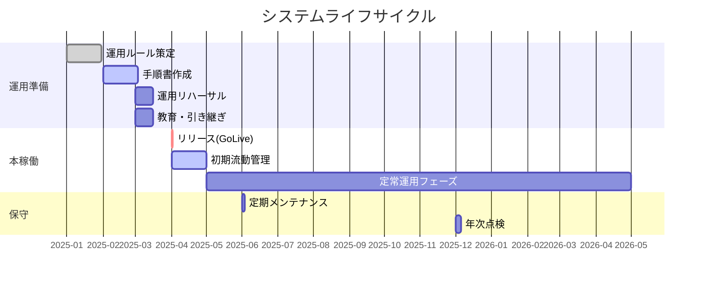

# 53. 運用・保守計画書

| 項目 | 内容 |
| :--- | :--- |
| プロジェクト名 | {{ProjectName}} |
| 版数 | 1.0 |
| 作成日 | 202X/XX/XX |
| 作成者 | {{Author}} |
| 最新更新日 | 202X/XX/XX |
| 承認者 | {{Approver}} |

---

## 目次
1. [本書の目的・分掌](#1-本書の目的・分掌)
2. [運用・保守業務の定義](#2-運用・保守業務の定義)
3. [運用・保守業務リスト（スコープ定義）](#3-運用・保守業務リストスコープ定義)
4. [各業務概要](#4-各業務概要)
5. [運用・保守体制](#5-運用・保守体制)
6. [運用・保守スケジュール（ライフサイクル）](#6-運用・保守スケジュールライフサイクル)
7. [課題と対応](#7-課題と対応)
8. [変更履歴](#8-変更履歴)

---

## 1. 本書の目的・分掌
本ドキュメントは、システムリリース後の安定稼働および品質維持を目的とし、運用・保守フェーズにおける業務範囲、体制、ルールを定義する。

- **計画書（本書）**: 運用・保守の「範囲」「体制」「スケジュール」を定義する（契約・SLAレベル）。
- **手順書 (No.54)**: 具体的なオペレーション手順、障害時のコマンド操作等を定義する（作業レベル）。

## 2. 運用・保守業務の定義
本プロジェクトにおける用語および業務カテゴリを以下の通り定義する。

| カテゴリ | 定義 | 目的 |
| :--- | :--- | :--- |
| **業務運用** | システムを利用して行う実際のビジネス業務。<br>（例：受注入力、承認、データ分析） | ビジネス価値の創出 |
| **システム運用** | システムを正常に稼働させ続けるための定常作業。<br>（例：監視、バックアップ、アカウント管理） | サービスの安定提供 |
| **保守（Maintenance）** | システムの修正、変更、改善を行う作業。<br>（例：バグ修正、OSパッチ適用、機能追加） | 品質の維持・向上 |

## 3. 運用・保守業務リスト（スコープ定義）
責任分界点を明確にするため、各業務の実施主体と範囲（In/Out）を定義する。

### 3.1. 業務運用（Business Operation）
**原則としてシステム開発側の作業範囲外（Out of Scope）とする。**

| ID | 業務項目 | 実施主体 | 開発側スコープ | 備考 |
| :--- | :--- | :--- | :---: | :--- |
| BO-01 | マスタデータ登録・更新 | ユーザ | 対象外 | 商品追加等は管理画面からユーザ実施 |
| BO-02 | コンテンツ更新（CMS） | ユーザ | 対象外 | お知らせ配信等 |
| BO-03 | ユーザからの問合せ対応 | ユーザ(CS) | 対象外 | 一般利用者（エンドユーザ）対応 |
| BO-04 | データ抽出・分析 | ユーザ | 対象外 | ダッシュボード機能を利用 |

### 3.2. システム運用・保守（System Operation & Maintenance）
**原則としてシステム開発・保守側の作業範囲内（In Scope）とする。**

| ID | 業務項目 | 実施主体 | 開発側スコープ | 備考 |
| :--- | :--- | :--- | :---: | :--- |
| SO-01 | 死活監視・リソース監視 | 保守担当 | **対象** | 24H365D 自動監視 |
| SO-02 | 定期バックアップ確認 | 保守担当 | **対象** | 日次自動、週次確認 |
| SO-03 | 障害一次対応（復旧） | 保守担当 | **対象** | アラート検知時の再起動等 |
| SO-04 | 問い合わせ調査（2次） | 保守担当 | **対象** | システムログ調査が必要なもの |
| SM-01 | アプリケーションバグ修正 | 保守担当 | **対象** | 瑕疵担保または保守契約範囲内 |
| SM-02 | OS/MWセキュリティパッチ | 保守担当 | **対象** | 緊急度に応じて実施 |
| SM-03 | 機能追加・仕様変更 | 保守担当 | 別途協議 | 追加見積もり対応 |

## 4. 各業務概要
スコープ「対象」の業務について、内容と頻度を定義する。

### 4.1. 定常運用業務
| ID | 業務名 | 実施内容 | 実施頻度 | 担当ロール |
| :--- | :--- | :--- | :--- | :--- |
| SO-01 | システム監視 | CloudWatchによるCPU、メモリ、エラーログ監視。アラート時はメール発報。 | 常時 | 自動(ツール) |
| SO-02 | 日次バックアップ | DBスナップショットの取得およびS3への転送。 | 毎日 03:00 | 自動(ツール) |
| SO-02 | バックアップ確認 | バックアップが正常に取得できているかログを目視確認。 | 毎週月曜 | 運用オペレータ |
| SO-05 | ドメイン・証明書更新 | SSL証明書の期限確認と更新作業。 | 年1回 | インフラ担当 |

### 4.2. 障害対応業務
| ID | 業務名 | 実施内容 | 開始条件 | 目標復旧時間(SLA) |
| :--- | :--- | :--- | :--- | :--- |
| SO-03 | 障害一次対応 | サービスの再起動、サーバ再起動等の手順書ベースの復旧作業。 | アラート検知 | 2時間以内 |
| SO-04 | 障害調査・恒久対応 | ログ詳細解析、プログラム修正、パッチ適用。 | 一次対応後 | 発生から3営業日以内(暫定) |

## 5. 運用・保守体制
本稼働後の連絡体制およびエスカレーションフロー。
※詳細は **[33_体制図](../20_ITPJ_Specs/33_体制図.md)** の「運用フェーズ」タブを参照。

```mermaid
graph TD
    User[エンドユーザ] -->|問合せ| Help[ヘルプデスク/業務担当]
    Help -->|システム起因?| Ops[システム運用担当]
    
    subgraph 開発・保守チーム
    Ops -->|技術調査依頼| Dev[保守開発担当]
    Dev -->|インフラ設定| Infra[インフラ担当]
    end
    
    System[監視システム] -->|アラートメール| Ops
```

  - **連絡受付時間**: 平日 09:30 - 18:00
  - **緊急連絡先**: 休日夜間は自動音声またはメール受付とし、翌営業日対応とする（※24/365契約でない場合）。

## 6\. 運用・保守スケジュール（ライフサイクル）

リリース前からサービス終了までの全体スケジュール。**特に「準備フェーズ」での教育と引き継ぎを重視する。**



### 6.1. 準備フェーズ（Pre-Operation）

  - 運用フローの机上シミュレーション
  - アラート発報テスト（実際にメールが飛ぶか、Slack通知されるか）
  - 障害訓練（わざとサーバを落として手順書通りに復旧できるか）

### 6.2. 初期流動管理フェーズ（Hypercare）

  - 期間: リリース後 1ヶ月間
  - 体制: 開発メンバーが常時待機し、問い合わせやエラーに即応する特別体制。
  - 定例会: 毎日または週次で障害状況を確認する。

## 7\. 課題と対応

運用設計段階での懸念事項と対応方針。

| ID | 課題・リスク | 対応方針 | ステータス |
| :--- | :--- | :--- | :--- |
| 1 | **属人化のリスク**<br>特定のエンジニアしか詳細を知らない機能がある。 | 手順書の詳細化に加え、運用引き継ぎ会（勉強会）を録画し、ナレッジとして残す。 | 対応中 |
| 2 | **ディスク容量枯渇**<br>ログ出力量が想定より多く、ストレージを圧迫する懸念。 | ログローテーション設定を3ヶ月→1ヶ月に変更し、S3へ逃がすライフサイクルを設定する。 | 完了 |
| 3 | **OSサポート切れ**<br>利用OS（Linux）のEOLが2年後に迫っている。 | 次年度予算にてバージョンアップ改修を計画するよう、顧客へ提案済み。 | 提案済 |

## 8\. 変更履歴

| 版数 | 変更日 | 変更概要 | 承認者 |
| :--- | :--- | :--- | :--- |
| 1.0 | 202X/MM/DD | 初版制定 | {{Approver}} |