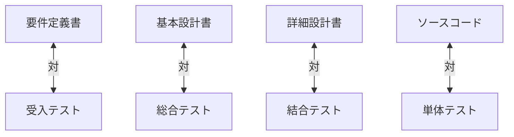

# 56. プロセスとドキュメント

## 1. V字モデルとトレーサビリティ
システム開発では、左側の「設計」と右側の「テスト」が対になっています。
ドキュメントは、この対関係（トレーサビリティ）を保証するために存在します。

## 2\. 各工程におけるドキュメントの役割

### 2.1. 要件定義（What）

  - **作成ドキュメント**: 業務フロー図、画面一覧、機能一覧
  - **役割**: 「何を作るか」を顧客と合意する。ここがブレると全ての手戻りになる。

### 2.2. 基本設計（High-Level How）

  - **作成ドキュメント**: システム構成図、ER図、I/F一覧
  - **役割**: 「どう実現するか」の骨組みを決める。全体最適を視る。

### 2.3. 詳細設計（Low-Level How）

  - **作成ドキュメント**: クラス図、処理フロー、画面項目定義
  - **役割**: プログラマが迷わず実装できるレベルまで落とし込む。

### 2.4. テスト・運用（Check & Act）

  - **作成ドキュメント**: テスト計画書、手順書、障害報告書
  - **役割**: 品質を客観的に証明し、安定稼働を維持する。

## 3\. 「完了」の定義

本プロジェクトにおいて、タスクの「完了」とは以下の状態を指します。

  - [ ] コードが実装されている。
  - [ ] テストが通り、パスしている。
  - [ ] **関連するドキュメント（仕様書・設計書）が更新されている。**

コードだけ修正してドキュメントを直さないのは「未完了」です。
