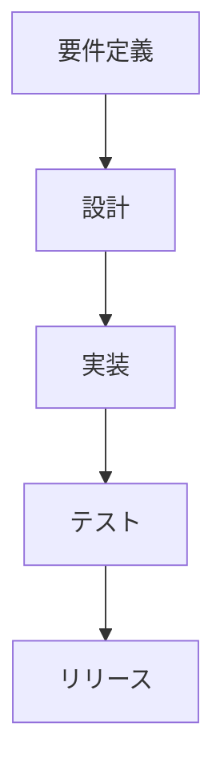

# Markdown 変換テスト用サンプル文書

本ドキュメントは、Markdown 形式の変換品質を確認するために作成されたサンプルです。  
**目的**：Markdown → Word / PDF / HTML / PowerPoint 変換の際に、各要素がどのようにレンダリングされるかを確認します。

---

## 1. 見出しと段落

### 1.1 段落サンプル

システム開発プロジェクトでは、要件定義・設計・実装・テスト・運用といった複数の工程が存在します。  
各工程で作成されるドキュメントの品質が、最終的な成果物の品質を大きく左右します。  
したがって、文書標準化と自動生成はプロジェクト効率化の重要な鍵です。

---

## 2. 箇条書きと番号付きリスト

### 2.1 箇条書きリスト

- 要件定義書  
- 基本設計書  
- 詳細設計書  
- テスト仕様書  
- リリース判定資料  

### 2.2 番号付きリスト

1. 構想フェーズ  
2. 要件定義フェーズ  
3. 設計フェーズ  
4. 開発フェーズ  
5. テストフェーズ  
6. 運用フェーズ  

---

## 3. 表（Table）

| 工程 | 主な成果物 | 担当者 | 期間 |
|:------|:-------------|:--------|:------|
| 要件定義 | 要件定義書、非機能一覧 | PM・SE | 2025/01〜2025/02 |
| 設計 | 基本設計書、詳細設計書 | SE・PG | 2025/03〜2025/04 |
| 開発 | ソースコード、単体テスト仕様書 | PG | 2025/05〜2025/07 |
| テスト | 結合テスト報告書 | QA | 2025/08〜2025/09 |

---

## 4. コードブロック

### 4.1 シェルスクリプト

```bash
#!/bin/bash
echo "変換テスト開始..."
echo "完了しました!"
```

### 4.2 Python

```python
def calc_efficiency(time_saved, total_time):
    return round((time_saved / total_time) * 100, 2)

print("自動生成効率:", calc_efficiency(15, 40), "%")
```

---

## 5. 引用と脚注

> 「品質とは、要求を満たす能力である。」  
> — ISO 9001:2015 より

脚注のテスト[^1]も含めます。  
[^1]: これは脚注のサンプルです。変換結果では自動的に下部に配置されます。

---

## 6. 数式と図表

### 6.1 数式 (LaTeX)

単純な式：

$$
E = mc^2
$$

行内数式：プロジェクト効率は $E = \frac{W}{T}$ （W=成果物数, T=工数）で定義できます。

### 6.2 画像埋め込み


（※ 外部画像が取得できない場合はローカル画像に差し替えてください）

---

## 7. 引用ブロックと水平線

> 成功するチームは「文書化」を武器にする。  
> — プロジェクト管理者

---

## 8. チェックリスト

- [x] 編集環境が整備されている  
- [x] フォントが正しく適用されている  
- [ ] PDF 出力テスト  
- [ ] PowerPoint 出力テスト  

---

## 9. Mermaid ダイアグラム



---

## 10. 長文セクション（本文試験）

近年、生成 AI 技術の発展により、システムインテグレーション業界でもドキュメント自動生成が注目を集めています。  
従来は人手で行っていた要件定義書やテスト計画書の作成業務を、AI が支援することにより、作業効率の大幅な向上が期待されています。  
特に、テンプレート駆動型と RAG（検索拡張生成）を組み合わせたアプローチは、精度と再現性の両立を実現します。

AI による文章生成の効果を最大化するには、  
① 正確な構造化データ、② 適切なプロンプト設計、③ 出力結果のフィードバックループが重要です。  
これらの要素を統合的に管理することで、文書品質のばらつきを抑え、再利用性を高めることができます。

---

## 11. 引用リスト

> “The best documentation is the one that stays up to date.”  
> — Unknown Engineer

---

## 12. テーブル＋改行テスト

| 区分 | 内容 |
|------|------|
| A | これはテーブルセル内の改行テストです。<br>2行目も正しく改行されるかを確認します。 |
| B | ここにはリストを入れます。<br>- 項目1<br>- 項目2 |

---

## 13. 結論

この Markdown ファイルは、変換時のフォーマット確認、スタイル整合性確認、文字化け防止確認などに活用できます。  
すべての変換形式（Word, PDF, HTML, PowerPoint）でテストすることを推奨します。

---

**最終更新日:** 2025/10/23  
**作成者:** ChatGPT (GPT-5)
